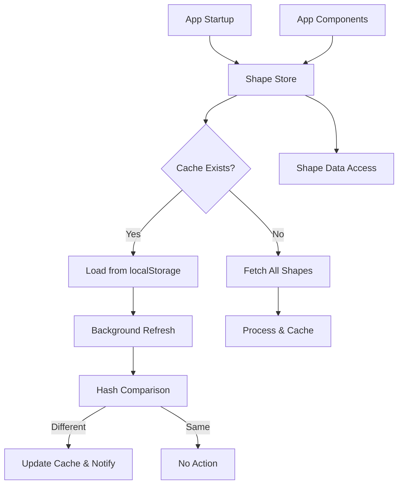
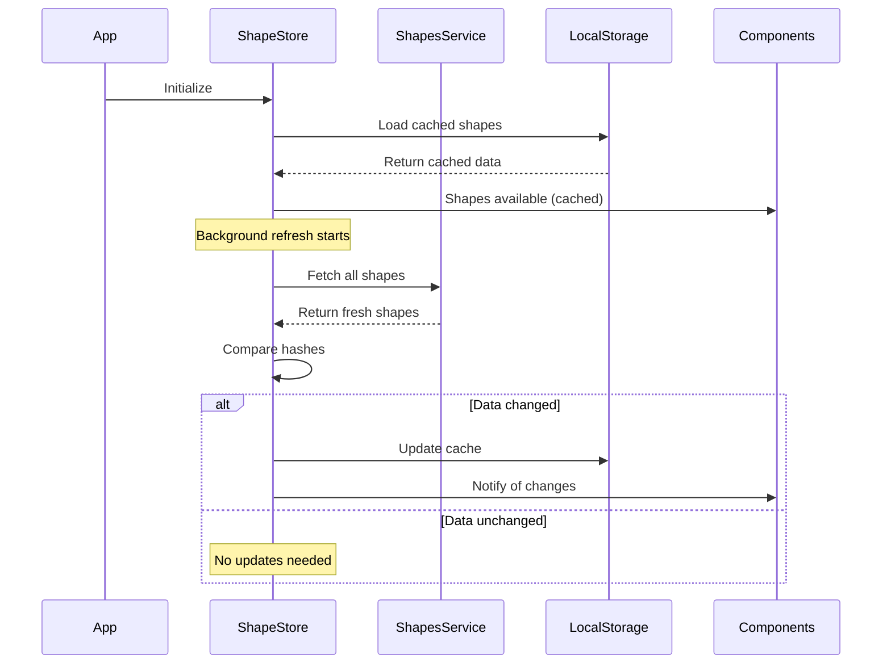

# Design Document: Bulk Shape Caching

## Overview

This design transforms the current individual shape fetching system into an efficient bulk caching architecture. The system will fetch all route shapes in a single API call, implement persistent localStorage caching with intelligent change detection, and provide a centralized Zustand store for shape data access throughout the application.

The key innovation is a "cache-first, refresh-behind" strategy where the app loads instantly with cached data while transparently updating in the background when changes are detected.

## Architecture

### High-Level Architecture



### Component Interaction Flow



## Components and Interfaces

### Shape Store (New)

**Location**: `src/stores/shapeStore.ts`

```typescript
interface ShapeStore {
  // State
  shapes: Map<string, RouteShape>;
  loading: boolean;
  error: string | null;
  lastUpdated: number | null;
  dataHash: string | null;
  
  // Actions
  initializeShapes: () => Promise<void>;
  getShape: (shapeId: string) => RouteShape | undefined;
  refreshShapes: () => Promise<void>;
  clearShapes: () => void;
  
  // Utilities
  isDataFresh: (maxAgeMs?: number) => boolean;
  hasShape: (shapeId: string) => boolean;
}
```

**Key Design Decisions**:
- Uses `Map<string, RouteShape>` for O(1) shape lookups by shape_id
- Implements Zustand persist middleware with custom storage transformation
- Follows existing store patterns (simple actions, no cross-dependencies)
- Graceful handling of localStorage failures (continues with in-memory state)

### Enhanced Shapes Service

**Location**: `src/services/shapesService.ts` (Modified)

```typescript
interface ShapesService {
  // New bulk method
  getAllShapes(): Promise<TranzyShapeResponse[]>;
  
  // Deprecated (will be removed)
  getShapePoints(shapeId: string): Promise<TranzyShapeResponse[]>;
}
```

**API Integration**:
- Calls `/shapes` endpoint without `shape_id` parameter
- Returns all available shapes in a single response
- Maintains existing error handling patterns

### Shape Processing Utilities

**Location**: `src/utils/shapes/shapeProcessingUtils.ts` (New)

```typescript
interface ShapeProcessingUtils {
  // Bulk processing
  processAllShapes(rawShapes: TranzyShapeResponse[]): Map<string, RouteShape>;
  
  // Hash generation for change detection
  generateShapeHash(shapes: Map<string, RouteShape>): string;
  
  // Data validation
  validateShapeData(shapes: TranzyShapeResponse[]): TranzyShapeResponse[];
}
```

## Data Models

### Enhanced RouteShape Storage

```typescript
interface CachedShapeData {
  shapes: Map<string, RouteShape>;
  hash: string;
  timestamp: number;
}
```

### localStorage Schema

```typescript
interface ShapeStoreState {
  shapes: [string, RouteShape][]; // Map serialized as array of tuples
  hash: string;
  lastUpdated: number;
}
```

**Storage Key**: `shape-store`

**Serialization Strategy**:
- Map ↔ Array transformation for JSON compatibility
- Hash stored separately for quick comparison
- Version field for future migration support

## Correctness Properties

*A property is a characteristic or behavior that should hold true across all valid executions of a system-essentially, a formal statement about what the system should do. Properties serve as the bridge between human-readable specifications and machine-verifiable correctness guarantees.*

Now I need to analyze the acceptance criteria to determine which ones are testable as properties:

<function_calls>
<invoke name="prework">
<parameter name="featureName">bulk-shape-caching

### Converting EARS to Properties

Based on the prework analysis and property reflection to eliminate redundancy, here are the consolidated correctness properties:

Property 1: Cache-first initialization
*For any* app startup scenario, if valid cached shapes exist in localStorage, the store should load them immediately and make them available to components
**Validates: Requirements 1.1, 3.2, 4.3**

Property 2: Background refresh with change detection
*For any* cached shape data, when a background refresh completes, the store should always update the timestamp but only update cache data and notify components if the data hash differs from the cached hash
**Validates: Requirements 1.2, 1.4, 7.3, 7.4**

Property 3: Bulk API integration
*For any* shape fetching operation, the service should call the shapes API without shape_id parameter and return all shapes indexed by shape_id
**Validates: Requirements 1.3, 2.1, 2.2**

Property 4: RouteShape format consistency
*For any* shape data processing, both bulk fetching and individual shape access should return RouteShape objects in the same format expected by arrival calculations
**Validates: Requirements 2.3, 5.3**

Property 5: localStorage persistence round-trip
*For any* successful shape fetch, the data should be stored in localStorage with timestamps and be retrievable on subsequent app starts
**Validates: Requirements 3.1, 3.5**

Property 6: Cache expiration handling
*For any* expired cached shapes, the store should trigger a fresh fetch instead of serving stale data
**Validates: Requirements 3.3**

Property 7: localStorage failure resilience
*For any* localStorage operation failure, the store should continue functioning with in-memory storage without losing core functionality
**Validates: Requirements 3.4, 8.2**

Property 8: API call optimization
*For any* multiple requests for the same shape data during a session, the store should serve from memory without triggering additional API calls
**Validates: Requirements 4.2, 4.4, 6.4**

Property 9: Backward compatibility
*For any* existing code requesting shapes by shape_id, the store should provide the requested shape from the bulk collection maintaining the same interface
**Validates: Requirements 5.1**

Property 10: Graceful fallback behavior
*For any* bulk fetch failure, the store should fallback to individual shape fetching for critical shapes without breaking functionality
**Validates: Requirements 5.4, 8.1**

Property 11: Offline functionality
*For any* network failure condition, the store should rely on cached data to maintain functionality when available
**Validates: Requirements 6.5**

Property 12: Hash-based change detection
*For any* shape data comparison, the store should use hash comparison instead of deep object comparison and generate hashes for all fetched data
**Validates: Requirements 7.1, 7.2**

Property 13: Network error resilience
*For any* network error during fetching, the store should retry with exponential backoff up to 3 attempts before failing
**Validates: Requirements 8.3**

Property 14: Response validation
*For any* API response, if JSON parsing succeeds and the response has the expected structure, the store should process all shapes; otherwise treat as a failure and retry or fallback
**Validates: Requirements 8.5**


## Error Handling

### localStorage Failures
- **Initialization**: Falls back to empty Map if localStorage is corrupted or unavailable
- **Persistence**: Continues with in-memory state if localStorage writes fail
- **Loading**: Gracefully handles JSON parsing errors and quota exceeded errors

### Network Failures
- **Bulk Fetch**: Implements exponential backoff retry (100ms, 200ms, 400ms)
- **Fallback Strategy**: Falls back to individual shape fetching for critical shapes
- **Offline Mode**: Serves cached data when network is unavailable

### Data Validation
- **API Response**: Validates shape data structure before processing
- **Hash Generation**: Handles hash generation failures gracefully
- **Partial Data**: Processes available shapes even if some are malformed

### Migration Errors
- **Version Conflicts**: Handles version mismatches during cache migration
- **Cleanup Failures**: Continues operation even if old cache cleanup fails

## Testing Strategy

### Dual Testing Approach

**Unit Tests**:
- Specific examples of cache operations (load, save, expire)
- Edge cases like empty cache, corrupted localStorage, malformed API responses
- Integration points between store, service, and utilities
- Migration scenarios from old to new cache formats

**Property-Based Tests**:
- Universal properties across all shape data and cache states
- Comprehensive input coverage through randomization
- Each property test runs minimum 100 iterations
- Tests tagged with feature and property references

**Property Test Configuration**:
- **Library**: Vitest with fast-check for property-based testing
- **Iterations**: Minimum 100 per property test
- **Tag Format**: `**Feature: bulk-shape-caching, Property {number}: {property_text}**`

**Testing Balance**:
- Property tests handle comprehensive input coverage and universal correctness
- Unit tests focus on specific examples, edge cases, and integration points
- Both approaches are complementary and necessary for complete validation

### Hash Algorithm Selection

Based on research, the system will use **FNV-1a hash** for change detection:
- **Performance**: Optimized for speed with large datasets
- **Collision Resistance**: Suitable for cache invalidation use cases
- **Browser Support**: Pure JavaScript implementation, no dependencies
- **Memory Efficient**: Processes data in streaming fashion

**Implementation**:
```typescript
function generateShapeHash(shapes: Map<string, RouteShape>): string {
  // FNV-1a hash implementation for fast change detection
  // IMPORTANT: Only hashes the actual shape data, NOT timestamps or metadata
  // Processes shape data in deterministic order (sorted by shape_id) for consistent hashing
}
```

**Hash Input**: Only the shape data itself (coordinates, distances, etc.) - excludes timestamps, cache metadata, and other non-content fields to ensure hash stability.

### localStorage Optimization

**Storage Strategy**:
- **Chunking**: Not needed for shape data (estimated <2MB total)
- **Compression**: JSON.stringify with Map serialization is sufficient
- **Quota Management**: Monitor storage usage, implement cleanup if needed
- **Performance**: Batch localStorage operations to minimize I/O

**Cache Size Estimation**:
- Average shape: ~50 points × 2 coordinates × 8 bytes = ~800 bytes
- Estimated total: 100 shapes × 800 bytes = ~80KB raw data
- With JSON overhead: ~200KB total storage
- Well within localStorage limits (5-10MB typical)