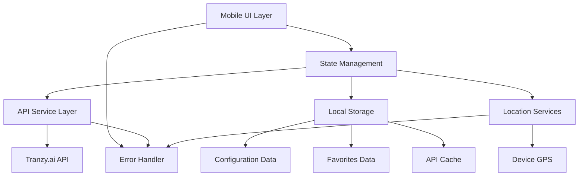

# Bus Tracker Design Document

## Overview

The Bus Tracker is a mobile-first reactive web application that provides intelligent bus tracking using tranzy.ai data. The system features real-time updates, directional intelligence, comprehensive error handling, and user-friendly configuration management. The architecture emphasizes responsive design, offline capability, and efficient data management.

## Architecture

### High-Level Architecture



### Technology Stack

- **Frontend Framework**: React with TypeScript for type safety and component reusability
- **State Management**: Zustand for lightweight, reactive state management
- **Styling**: Tailwind CSS for responsive mobile-first design
- **HTTP Client**: Axios with interceptors for API communication and error handling
- **Location Services**: Browser Geolocation API with fallback options
- **Storage**: LocalStorage with encryption for sensitive data
- **Build Tool**: Vite for fast development and optimized builds
- **Testing**: Vitest for unit tests, fast-check for property-based testing

## Components and Interfaces

### Core Components

#### 1. App Shell
- **Purpose**: Main application container with navigation and global state
- **Responsibilities**: Route management, global error boundary, theme provider
- **Props**: None (root component)

#### 2. Configuration Manager
- **Purpose**: Handles initial setup and settings management
- **Responsibilities**: City selection, location setup, API key management, refresh rate configuration
- **Props**: `onConfigComplete: () => void`

#### 3. Bus Display
- **Purpose**: Main bus information display with directional sections
- **Responsibilities**: Shows "Going to work" and "Going home" sections with live/scheduled data
- **Props**: `buses: BusInfo[], direction: 'work' | 'home'`

#### 4. Favorites Manager
- **Purpose**: Manages favorite buses and stations
- **Responsibilities**: Add/remove favorites, filter stations by favorite buses
- **Props**: `favorites: Favorites, onUpdate: (favorites: Favorites) => void`

#### 5. Error Display
- **Purpose**: Visual error state indicators
- **Responsibilities**: Shows different error types with appropriate colors and actions
- **Props**: `error: ErrorState, onRetry?: () => void`

#### 6. Station List
- **Purpose**: Displays buses for specific stations
- **Responsibilities**: Shows next buses at selected stations with timing information
- **Props**: `station: Station, buses: BusInfo[]`

### Data Interfaces

```typescript
interface BusInfo {
  id: string;
  route: string;
  destination: string;
  arrivalTime: Date;
  isLive: boolean;
  minutesAway: number;
  station: Station;
  direction: 'work' | 'home' | 'unknown';
}

interface Station {
  id: string;
  name: string;
  coordinates: Coordinates;
  isFavorite: boolean;
}

interface Coordinates {
  latitude: number;
  longitude: number;
}

interface UserConfig {
  city: string;
  homeLocation: Coordinates;
  workLocation: Coordinates;
  apiKey: string;
  refreshRate: number; // milliseconds
}

interface Favorites {
  buses: string[]; // bus route IDs
  stations: string[]; // station IDs
}

interface ErrorState {
  type: 'network' | 'parsing' | 'noData' | 'partial' | 'authentication';
  message: string;
  timestamp: Date;
  retryable: boolean;
}
```

### API Service Interface

```typescript
// Legacy API Service (for backward compatibility)
interface TranzyApiService {
  getBusesForCity(city: string): Promise<BusInfo[]>;
  getStationsForCity(city: string): Promise<Station[]>;
  getBusesAtStation(stationId: string): Promise<BusInfo[]>;
  validateApiKey(key: string): Promise<boolean>;
}

// Enhanced API Service (with caching and GTFS support)
interface EnhancedTranzyApiService {
  // Core data fetching with caching
  getAgencies(forceRefresh?: boolean): Promise<Agency[]>;
  getRoutes(agencyId: number, forceRefresh?: boolean): Promise<Route[]>;
  getStops(agencyId: number, forceRefresh?: boolean): Promise<Station[]>;
  getTrips(agencyId: number, routeId?: number, forceRefresh?: boolean): Promise<Trip[]>;
  getStopTimes(agencyId: number, stopId?: number, tripId?: string, forceRefresh?: boolean): Promise<StopTime[]>;
  getVehicles(agencyId: number, routeId?: number): Promise<LiveVehicle[]>;
  
  // Combined data for enhanced bus info
  getEnhancedBusInfo(agencyId: number, stopId?: number, routeId?: number, forceRefresh?: boolean): Promise<EnhancedBusInfo[]>;
  
  // Cache management
  forceRefreshAll(agencyId: number): Promise<void>;
  getCacheStats(): CacheStats;
  clearCache(): void;
}

// Enhanced Bus Info combining schedule and live data
interface EnhancedBusInfo {
  id: string;
  route: string;
  routeId: string;
  destination: string;
  direction: 'work' | 'home' | 'unknown';
  scheduledArrival?: Date;
  liveArrival?: Date;
  estimatedArrival: Date;
  minutesAway: number;
  delay?: number;
  isLive: boolean;
  isScheduled: boolean;
  confidence: 'high' | 'medium' | 'low';
  station: Station;
  vehicle?: LiveVehicle;
  schedule?: Schedule;
}
```

### Caching Strategy

```typescript
// Cache configuration per data type
const CACHE_CONFIGS = {
  agencies: { ttl: 7 * 24 * 60 * 60 * 1000 },    // 7 days
  routes: { ttl: 24 * 60 * 60 * 1000 },          // 24 hours
  stops: { ttl: 24 * 60 * 60 * 1000 },           // 24 hours
  trips: { ttl: 24 * 60 * 60 * 1000 },           // 24 hours
  stopTimes: { ttl: 24 * 60 * 60 * 1000 },       // 24 hours
  schedules: { ttl: 24 * 60 * 60 * 1000 },       // 24 hours
  vehicles: { ttl: 60 * 1000 },                   // 1 minute
};
```

## Data Models

### State Management Structure

The application uses Zustand stores for different concerns:

#### Configuration Store
```typescript
interface ConfigStore {
  config: UserConfig | null;
  isConfigured: boolean;
  updateConfig: (config: Partial<UserConfig>) => void;
  resetConfig: () => void;
}
```

#### Bus Data Store
```typescript
interface BusStore {
  buses: BusInfo[];
  stations: Station[];
  lastUpdate: Date | null;
  isLoading: boolean;
  error: ErrorState | null;
  refreshBuses: () => Promise<void>;
  clearError: () => void;
}
```

#### Favorites Store
```typescript
interface FavoritesStore {
  favorites: Favorites;
  addFavoriteBus: (routeId: string) => void;
  removeFavoriteBus: (routeId: string) => void;
  addFavoriteStation: (stationId: string) => void;
  removeFavoriteStation: (stationId: string) => void;
  getFilteredStations: () => Station[];
}
```

#### Location Store
```typescript
interface LocationStore {
  currentLocation: Coordinates | null;
  locationPermission: 'granted' | 'denied' | 'prompt';
  requestLocation: () => Promise<Coordinates>;
  calculateDistance: (from: Coordinates, to: Coordinates) => number;
}
```

### Data Flow

1. **Initialization**: Configuration store loads saved settings or prompts for setup
2. **Location Detection**: Location store requests GPS permission and current position
3. **API Integration**: Bus store fetches data from Tranzy API using configuration
4. **Direction Intelligence**: Algorithm analyzes routes and user locations to determine direction
5. **Real-time Updates**: Automatic refresh based on configured interval
6. **Error Handling**: Error states propagate through stores and display in UI

## Correctness Properties

*A property is a characteristic or behavior that should hold true across all valid executions of a system—essentially, a formal statement about what the system should do. Properties serve as the bridge between human-readable specifications and machine-verifiable correctness guarantees.*

Based on the prework analysis and property reflection, the following correctness properties ensure the system behaves correctly across all valid inputs:

### Property 1: Configuration persistence and application
*For any* valid configuration change, saving the configuration should persist all data and apply changes immediately without requiring application restart
**Validates: Requirements 1.5, 3.4**

### Property 2: Favorite bus station filtering
*For any* set of favorite buses, the filtered station results should only contain stations where at least one favorite bus stops
**Validates: Requirements 2.2**

### Property 3: Immediate favorites view updates
*For any* modification to favorites (adding or removing), the filtered views should update immediately to reflect the changes
**Validates: Requirements 2.4**

### Property 4: Refresh rate timing compliance
*For any* valid refresh rate setting, background data updates should occur at intervals matching the specified rate (±10% tolerance)
**Validates: Requirements 3.2**

### Property 5: Manual refresh bypass
*For any* refresh rate setting, triggering manual refresh should immediately query the API regardless of the automatic timing schedule
**Validates: Requirements 3.3**

### Property 6: Error state management
*For any* service call failure, parsing error, or partial data scenario, the system should display appropriate error indicators and provide retry options when applicable
**Validates: Requirements 4.2, 4.4, 4.5**

### Property 7: Live vs scheduled data discrepancy detection
*For any* combination of live and scheduled bus data, missing live buses should be highlighted with distinct visual indicators
**Validates: Requirements 4.3**

### Property 8: Data presentation consistency
*For any* bus timing data (live or scheduled), the display format should consistently show "Bus X in Y minutes (live/scheduled) at HH:MM"
**Validates: Requirements 5.2, 5.3, 7.1**

### Property 9: Chronological bus ordering
*For any* collection of buses with arrival times, the display should list them in chronological order of arrival
**Validates: Requirements 7.2**

### Property 10: Direction classification accuracy
*For any* bus route with known endpoints and user locations, the direction intelligence should correctly categorize buses as "work" or "home" bound based on geographic proximity to destinations
**Validates: Requirements 5.4, 6.1, 6.2**

### Property 11: Metadata integration for direction accuracy
*For any* station with directional metadata, the direction determination should incorporate this information to improve classification accuracy
**Validates: Requirements 6.3, 6.4**

### Property 12: API key validation and storage
*For any* entered API key, the system should validate it against Tranzy API before storing, and stored keys should be encrypted and recoverable
**Validates: Requirements 8.2, 8.5**

### Property 13: Authentication header inclusion
*For any* API request, the system should include proper authentication headers with the stored API key
**Validates: Requirements 8.3**

### Property 14: Configuration round-trip integrity
*For any* valid user configuration, saving and reloading the configuration should preserve all settings exactly
**Validates: Requirements 1.2**

## Error Handling

### Error Classification System

The application implements a comprehensive error handling system with distinct visual indicators:

#### Network Errors
- **Trigger**: Failed API calls, timeout errors, connectivity issues
- **Display**: Red indicator with "Network Error" message and retry button
- **Action**: Automatic retry with exponential backoff, manual retry option

#### Data Errors
- **Parsing Errors**: Yellow indicator for malformed API responses
- **Partial Data**: Orange indicator when some expected data is missing
- **No Data**: Gray indicator when no data is available for scheduled updates

#### Authentication Errors
- **Invalid API Key**: Red indicator with reconfiguration prompt
- **Rate Limiting**: Blue indicator with wait time information

#### Location Errors
- **GPS Unavailable**: Yellow indicator with manual location entry option
- **Permission Denied**: Orange indicator with instructions for enabling location services

### Error Recovery Strategies

1. **Automatic Retry**: Network errors trigger automatic retry with exponential backoff (1s, 2s, 4s, 8s max)
2. **Graceful Degradation**: Show last known data with timestamp when real-time updates fail
3. **User Guidance**: Clear instructions for resolving configuration and permission issues
4. **Offline Mode**: Cache last successful data for offline viewing

## Testing Strategy

### Dual Testing Approach

The application uses both unit testing and property-based testing for comprehensive coverage:

#### Unit Testing with Vitest
- **Component Testing**: Verify specific UI components render correctly with given props
- **Integration Testing**: Test component interactions and data flow
- **Edge Case Testing**: Validate handling of empty states, error conditions, and boundary values
- **API Integration**: Test service layer with mocked responses

#### Property-Based Testing with fast-check
- **Library**: fast-check for TypeScript property-based testing
- **Iterations**: Minimum 100 iterations per property test to ensure statistical confidence
- **Generators**: Custom generators for bus data, coordinates, timestamps, and configuration objects
- **Property Tagging**: Each property test tagged with format: `**Feature: bus-tracker, Property X: [property description]**`

#### Testing Requirements
- Each correctness property must be implemented by a single property-based test
- Property tests verify universal behaviors across all valid inputs
- Unit tests catch specific bugs and validate concrete examples
- All tests must pass before deployment
- Test coverage minimum: 80% for critical paths, 60% overall

### Test Data Generation Strategy

#### Smart Generators
- **Coordinates Generator**: Produces valid latitude/longitude pairs within reasonable geographic bounds
- **Bus Data Generator**: Creates realistic bus information with consistent timing relationships
- **Configuration Generator**: Generates valid user configurations with proper constraints
- **Error State Generator**: Produces various error conditions for comprehensive error handling testing

#### Generator Constraints
- Coordinates constrained to valid geographic ranges (-90 to 90 lat, -180 to 180 lng)
- Bus timing constrained to realistic values (0-60 minutes away, valid 24-hour times)
- Configuration data constrained to valid formats (non-empty strings, positive refresh rates)
- API responses constrained to match Tranzy.ai schema expectations
