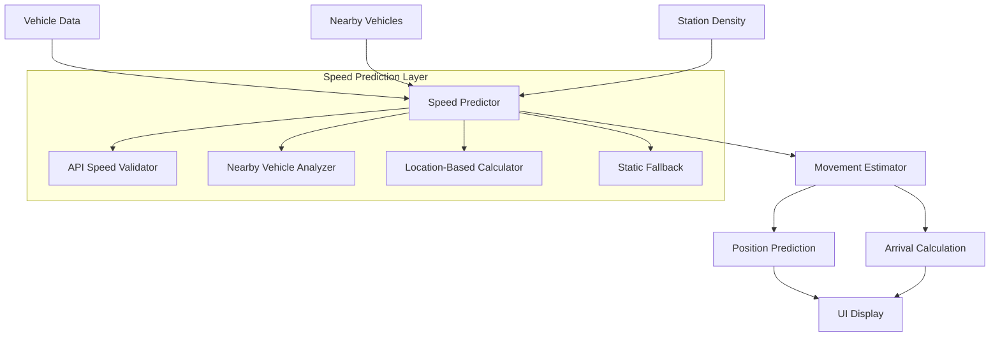

# Design Document

## Overview

The Dynamic Speed Prediction system enhances vehicle arrival time accuracy by replacing static speed constants with intelligent, real-time speed estimation. The system uses a hierarchical approach that prioritizes API speed data, falls back to nearby vehicle averaging, then location-based estimation, and finally static constants. This design integrates seamlessly with existing position prediction and arrival calculation systems while providing configurable parameters for different transit environments.

## Architecture

The system follows a layered architecture that extends existing vehicle prediction utilities:



The design maintains backward compatibility by enhancing existing functions rather than replacing them entirely.

## Components and Interfaces

### Core Speed Prediction Integration

Following the existing `EnhancedVehicleData` pattern, combining position and speed prediction into unified metadata:

```typescript
// Extend the existing EnhancedVehicleData interface with unified prediction metadata
export interface EnhancedVehicleData extends TranzyVehicleResponse {
  // Position prediction fields (existing)
  latitude: number;  // Predicted latitude (or original if no prediction)
  longitude: number; // Predicted longitude (or original if no prediction)
  apiLatitude: number;
  apiLongitude: number;
  
  // UNIFIED prediction metadata combining position and speed predictions
  predictionMetadata?: {
    // Position prediction data (existing)
    predictedDistance: number; // meters moved from position prediction
    stationsEncountered: number;
    totalDwellTime: number; // milliseconds
    positionMethod: 'route_shape' | 'fallback';
    positionApplied: boolean;
    timestampAge: number; // milliseconds
    
    // NEW: Speed prediction data
    predictedSpeed?: number; // km/h - main speed result
    speedMethod?: 'api_speed' | 'nearby_average' | 'location_based' | 'static_fallback';
    speedConfidence?: 'high' | 'medium' | 'low' | 'very_low';
    speedApplied?: boolean;
    apiSpeed?: number;
    nearbyVehicleCount?: number;
    nearbyAverageSpeed?: number;
    distanceToCenter?: number;
    locationBasedSpeed?: number;
    speedCalculationTimeMs?: number;
  };
}
```

### Speed Predictor Component

The main component that orchestrates speed prediction, integrated with existing vehicle enhancement:

```typescript
class SpeedPredictor {
  private densityCalculator: StationDensityCalculator;
  private densityCache: Map<string, StationDensityResult>;
  
  constructor();
  
  // Main prediction function - returns speed prediction data to be merged into predictionMetadata
  predictSpeed(
    vehicle: TranzyVehicleResponse,
    nearbyVehicles: TranzyVehicleResponse[],
    stationDensityCenter: Coordinates
  ): {
    predictedSpeed: number;
    speedMethod: 'api_speed' | 'nearby_average' | 'location_based' | 'static_fallback';
    speedConfidence: 'high' | 'medium' | 'low' | 'very_low';
    speedApplied: boolean;
    apiSpeed?: number;
    nearbyVehicleCount?: number;
    nearbyAverageSpeed?: number;
    distanceToCenter?: number;
    locationBasedSpeed?: number;
    speedCalculationTimeMs?: number;
  };
  
  // API Speed Processing
  private validateApiSpeed(speed: number | null | undefined): boolean;
  private convertSpeedUnits(speedKmh: number): number; // Convert km/h to m/s
  
  // Nearby Vehicle Analysis
  private filterNearbyVehicles(
    targetVehicle: TranzyVehicleResponse,
    allVehicles: TranzyVehicleResponse[]
  ): TranzyVehicleResponse[];
  private calculateNearbyAverage(
    vehicles: TranzyVehicleResponse[],
    targetVehicle: TranzyVehicleResponse
  ): number | null;
  
  // Location-Based Estimation
  private calculateLocationBasedSpeed(distanceToCenter: number): number;
  private calculateDistance(pos1: Coordinates, pos2: Coordinates): number;
  
  // Fallback and Error Handling
  private getStaticFallbackSpeed(): number; // Uses ARRIVAL_CONFIG.AVERAGE_SPEED
  private handleCalculationError(error: Error, vehicle: TranzyVehicleResponse): ReturnType<SpeedPredictor['predictSpeed']>;
  
  // Performance and Caching
  private withTimeout<T>(promise: Promise<T>, timeoutMs: number): Promise<T>;
  private getCachedDensityCenter(agencyId: string): StationDensityResult | null;
}
```

### Station Density Calculator

Calculates the geographic center weighted by station density:

```typescript
interface StationDensityResult {
  center: Coordinates;
  totalStations: number;
  averageDistance: number;
  calculatedAt: Date;
}

class StationDensityCalculator {
  calculateDensityCenter(stops: TranzyStopResponse[]): StationDensityResult;
  private calculateWeightedCentroid(stops: TranzyStopResponse[]): Coordinates;
}
```

### Enhanced Movement Estimator

Extends existing movement simulation with dynamic speed, reusing the existing `MovementSimulation` interface:

```typescript
interface EnhancedMovementSimulation extends MovementSimulation {
  speedPredictionData: {
    predictedSpeed: number;
    speedMethod: string;
    speedConfidence: string;
  };
  speedChanges: Array<{
    position: Coordinates;
    newSpeed: number;
    reason: 'station_departure' | 'traffic_change' | 'api_update';
  }>;
}

class EnhancedMovementEstimator {
  simulateMovementWithDynamicSpeed(
    elapsedTimeMs: number,
    movementData: RouteMovementData,
    vehicle: EnhancedVehicleData // Uses predictionMetadata.predictedSpeed
  ): EnhancedMovementSimulation;
  
  private applyDwellTime(vehicle: TranzyVehicleResponse, nearestStation: TranzyStopResponse): number;
  private recalculateSpeedAtStation(vehicle: TranzyVehicleResponse, station: TranzyStopResponse): ReturnType<SpeedPredictor['predictSpeed']>;
}
```

### Speed Display Component

Handles UI presentation of speed predictions and vehicle status using unified prediction metadata:

```typescript
interface SpeedDisplayProps {
  vehicle: EnhancedVehicleData;
  proximityThreshold: number; // meters to station for "At Stop" status
  showConfidence?: boolean;
}

interface SpeedDisplayState {
  displayText: string;
  displayValue: number | null;
  status: 'moving' | 'at_stop' | 'stationary';
  confidence: 'high' | 'medium' | 'low' | 'very_low';
  uncertaintyIndicator?: string;
}

class SpeedDisplayFormatter {
  formatSpeedDisplay(
    vehicle: EnhancedVehicleData,
    isNearStation: boolean,
    showConfidence: boolean
  ): SpeedDisplayState;
  
  private formatSpeed(speed: number): string; // km/h with 1 decimal place
  private getConfidenceIndicator(confidence: string): string;
  private determineVehicleStatus(speed: number, isNearStation: boolean): 'moving' | 'at_stop' | 'stationary';
}

// Integration with existing vehicle enhancement utilities
export function enhanceVehicleWithSpeedPrediction(
  vehicle: EnhancedVehicleData, // Already has position prediction
  nearbyVehicles: TranzyVehicleResponse[],
  stationDensityCenter: Coordinates
): EnhancedVehicleData {
  const speedPredictor = new SpeedPredictor();
  const speedPredictionData = speedPredictor.predictSpeed(vehicle, nearbyVehicles, stationDensityCenter);
  
  return {
    ...vehicle,
    predictionMetadata: {
      ...vehicle.predictionMetadata,
      ...speedPredictionData // Merge speed prediction into existing metadata
    }
  };
}
```

## Data Models

### Configuration Constants Extension

Extends existing `ARRIVAL_CONFIG` with speed prediction parameters:

```typescript
export const SPEED_PREDICTION_CONFIG = {
  // Speed validation
  SPEED_THRESHOLD: 5, // km/h - below this is considered stationary
  
  // Nearby vehicle analysis
  NEARBY_RADIUS: 1000, // meters
  MIN_NEARBY_VEHICLES: 2, // minimum for averaging
  
  // Location-based speed calculation
  LOCATION_SPEED: {
    BASE_SPEED: 25, // km/h - suburban/highway speed
    DENSITY_FACTOR: 0.3, // how much city center affects speed
    MAX_DISTANCE: 20000, // meters - beyond this, use base speed
  },
  
  // Update frequencies (reuse existing PREDICTION_UPDATE_CYCLE)
  DENSITY_CACHE_DURATION: 3600000, // ms - 1 hour cache for station density
  
  // Performance limits
  MAX_NEARBY_VEHICLES: 50, // limit for performance
  CALCULATION_TIMEOUT: 50, // ms - max time for speed calculation
} as const;
```

### Configuration Management

Simplified configuration management without runtime updates:

```typescript
class SpeedPredictionConfigManager {
  static validateSpeedThreshold(threshold: number): boolean {
    return threshold > 0 && threshold < 100; // reasonable range
  }
  
  static validateRadius(radius: number): boolean {
    return radius > 0 && radius <= 5000; // max 5km radius
  }
  
  static validateLocationSpeedParams(baseSpeed: number, densityFactor: number): boolean {
    return baseSpeed > 0 && baseSpeed < 200 && densityFactor >= 0 && densityFactor <= 1;
  }
  
  static logConfigurationAtStartup(): void {
    console.log('Speed Prediction Config:', SPEED_PREDICTION_CONFIG);
  }
}
```

### Vehicle Data Enhancement

Extends existing vehicle enhancement with unified prediction metadata:

```typescript
// The existing EnhancedVehicleData interface is extended with unified metadata (shown above)
// No new interfaces needed - just additional optional fields in predictionMetadata

// Integration functions to be added to vehicleEnhancementUtils.ts
export function enhanceVehicleWithSpeedPrediction(
  vehicle: EnhancedVehicleData, // Already has position prediction
  nearbyVehicles: TranzyVehicleResponse[],
  stationDensityCenter: Coordinates
): EnhancedVehicleData;

export function enhanceVehiclesWithSpeedPredictions(
  vehicles: EnhancedVehicleData[],
  stationDensityCenter: Coordinates
): EnhancedVehicleData[];

export function hasSpeedPredictionApplied(vehicle: EnhancedVehicleData): boolean {
  return vehicle.predictionMetadata?.speedApplied === true;
}

export function getSpeedPredictionSummary(vehicles: EnhancedVehicleData[]): {
  totalVehicles: number;
  speedPredictionsApplied: number;
  speedPredictionRate: number;
  speedMethodBreakdown: Record<string, number>;
  averageSpeedConfidence: number;
};
```

## Correctness Properties

*A property is a characteristic or behavior that should hold true across all valid executions of a system—essentially, a formal statement about what the system should do. Properties serve as the bridge between human-readable specifications and machine-verifiable correctness guarantees.*

### Property Reflection

After analyzing all acceptance criteria, I identified several areas where properties can be consolidated:

- **Speed validation and threshold logic** (1.1, 1.2, 1.3) can be combined into comprehensive input validation properties
- **Nearby vehicle filtering and averaging** (2.1, 2.2, 2.3) can be consolidated into spatial query and mathematical correctness properties
- **Fallback hierarchy** (1.4, 2.4, 4.1-4.5) can be tested as one comprehensive priority system property
- **Location-based calculations** (3.1-3.5) can be combined into geometric and formula correctness properties
- **Display logic** (6.1-6.4) can be combined into UI correctness properties

This consolidation eliminates redundancy while ensuring comprehensive coverage of all requirements.

### Speed Prediction Properties

Property 1: **API Speed Validation and Usage**
*For any* vehicle with API speed data, if the speed is numeric, non-negative, and above the threshold, then the speed predictor should return speed prediction data with `predictedSpeed` equal to the API speed value and `speedMethod` set to 'api_speed'
**Validates: Requirements 1.1, 1.2, 1.5**

Property 2: **Stationary Vehicle Classification**
*For any* vehicle with API speed at or below the speed threshold, the speed predictor should return speed prediction data with `speedMethod` reflecting the fallback method used
**Validates: Requirements 1.3**

Property 3: **Fallback Hierarchy Correctness**
*For any* vehicle and available data combination, the speed predictor should return speed prediction data with `speedMethod` indicating the highest priority available method: 'api_speed' > 'nearby_average' (≥2 vehicles) > 'location_based' > 'static_fallback'
**Validates: Requirements 1.4, 2.4, 4.1, 4.2, 4.3, 4.4, 4.5**

Property 4: **Nearby Vehicle Spatial Query and Filtering**
*For any* vehicle position and set of nearby vehicles, the speed predictor should only include vehicles within the configured radius that have valid speeds above the threshold, excluding the target vehicle itself
**Validates: Requirements 2.1, 2.2, 2.5**

Property 5: **Nearby Vehicle Average Calculation**
*For any* set of valid nearby vehicle speeds, the calculated average should equal the mathematical mean of those speeds
**Validates: Requirements 2.3**

Property 6: **Station Density Center Calculation**
*For any* set of transit stops, the calculated density center should be the correct geographic centroid of all station positions
**Validates: Requirements 3.1**

Property 7: **Distance-Speed Relationship**
*For any* two vehicle positions at different distances from the station density center, the vehicle closer to center should receive a lower or equal speed estimate than the farther vehicle
**Validates: Requirements 3.2, 3.3, 3.4**

Property 8: **Location-Based Speed Formula**
*For any* vehicle position and station density center, the location-based speed should be calculated using the exact formula: base_speed * (1 - density_factor * max(0, (max_distance - distance_to_center) / max_distance))
**Validates: Requirements 3.5**

Property 9: **Movement Calculation Integration**
*For any* vehicle movement calculation, the system should use the `predictionMetadata.predictedSpeed` value from the EnhancedVehicleData rather than static constants
**Validates: Requirements 5.1, 5.3**

Property 10: **Stationary Vehicle Dwell Time**
*For any* vehicle predicted to be stationary (speed ≤ threshold) AND located near a station, the movement estimator should apply dwell time calculations
**Validates: Requirements 5.2**

Property 11: **Dynamic Speed Recalculation**
*For any* multi-station route estimation, the movement estimator should recalculate predicted speed after each intermediate station based on current conditions
**Validates: Requirements 5.4**

Property 12: **Speed Display Format and Status**
*For any* vehicle display, the UI should show `predictionMetadata.predictedSpeed` in km/h with one decimal place when moving, or "At Stop" status when stationary near a station
**Validates: Requirements 6.1, 6.2, 6.3**

Property 13: **Confidence Indication**
*For any* speed prediction with `predictionMetadata.speedConfidence` set to 'low' or 'very_low', the display should indicate uncertainty with appropriate visual styling or text
**Validates: Requirements 6.4**

Property 14: **Configuration Parameter Validation**
*For any* speed prediction constant values, the system should validate they are within acceptable ranges during startup
**Validates: Requirements 7.4**

Property 15: **Graceful Error Handling**
*For any* invalid input data (coordinates, missing data, malformed speed values), the speed predictor should handle the error gracefully and return a valid fallback result
**Validates: Requirements 8.3, 8.4**

## Error Handling

The system implements comprehensive error handling at multiple levels to ensure reliability and graceful degradation:

### Input Validation and Sanitization
- **Speed Data Validation**: Validate numeric values, handle null/undefined/NaN, reject negative speeds
- **Coordinate Validation**: Validate latitude/longitude ranges (-90 to 90, -180 to 180), handle missing coordinates
- **Configuration Validation**: Validate parameter ranges, provide sensible defaults, log validation errors
- **Vehicle Data Validation**: Ensure required fields exist, handle malformed API responses

### Calculation Error Protection
- **Timeout Protection**: Limit calculation time to 50ms to prevent UI blocking
- **Division by Zero**: Handle edge cases in averaging and distance calculations
- **Overflow Protection**: Prevent unrealistic speed calculations (cap at reasonable maximums)
- **Floating Point Precision**: Handle precision issues in geographic calculations

### Fallback Mechanisms and Graceful Degradation
- **Hierarchical Fallbacks**: Always provide a valid speed estimate through the priority system
- **Partial Data Handling**: Function with incomplete nearby vehicle data or missing API speeds
- **Network Resilience**: Continue operation when external data sources are unavailable
- **Memory Management**: Handle large vehicle datasets without memory issues

### Error Logging and Monitoring
- **Structured Logging**: Record errors with context (vehicle ID, calculation method, input data)
- **Performance Monitoring**: Track calculation times and success rates for each method
- **Configuration Logging**: Log configuration values at startup for debugging
- **Error Categorization**: Classify errors by severity and impact on user experience

### Integration Safety and Backward Compatibility
- **Interface Stability**: Maintain existing interfaces to prevent breaking changes
- **Optional Enhancement**: Allow disabling dynamic prediction for rollback scenarios
- **Data Validation**: Verify all inputs before processing to prevent cascading failures
- **State Consistency**: Ensure system remains in valid state even after errors

### Specific Error Scenarios
- **Invalid Coordinates**: Return location-based estimate using default center point
- **No Nearby Vehicles**: Fall back to location-based estimation immediately
- **Malformed API Speed**: Treat as null and proceed with fallback hierarchy
- **Station Data Unavailable**: Use cached density center or default geographic center
- **Calculation Timeout**: Return static fallback speed with low confidence indicator

## Testing Strategy

The testing approach combines unit tests for specific scenarios with property-based tests for comprehensive coverage:

### Unit Testing Focus
- **Configuration Management**: Test parameter loading and validation
- **Error Scenarios**: Test specific error conditions and edge cases
- **Integration Points**: Test interfaces with existing arrival calculation system
- **Performance Benchmarks**: Verify calculation times meet requirements

### Property-Based Testing Focus
- **Mathematical Correctness**: Verify averaging, distance, and speed calculations
- **Hierarchical Logic**: Test fallback priority system across all input combinations
- **Spatial Relationships**: Test nearby vehicle detection and distance-based speed estimation
- **Input Validation**: Test robustness across all possible input variations

### Testing Configuration
- **Minimum 100 iterations** per property test for comprehensive input coverage
- **Fast-check library** for TypeScript property-based testing
- **Test tags** reference design properties: **Feature: dynamic-speed-prediction, Property N: [property text]**
- **Performance tests** separate from functional tests to avoid timeout issues

### Integration Testing
- **End-to-End Scenarios**: Test complete speed prediction → movement estimation → arrival calculation flow
- **Real Data Testing**: Use actual vehicle data to verify realistic behavior
- **Regression Testing**: Ensure existing arrival time accuracy is maintained or improved
- **A/B Testing Framework**: Support comparing dynamic vs static speed predictions