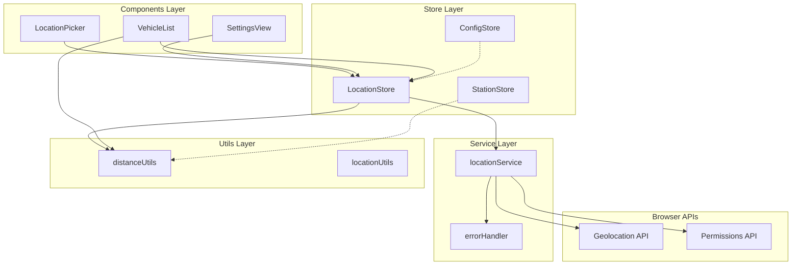

# Design Document: Location Services

## Overview

Location Services provides GPS functionality that integrates seamlessly with the existing bus tracking application architecture. The design follows established patterns: raw data stores, domain-focused services, simple loading/error states, and minimal cross-dependencies.

The system enables automatic location detection, distance calculations, and location-aware filtering while maintaining the application's lightweight, clean architecture principles.

## Architecture



## Components and Interfaces

### LocationStore (Zustand Store)

Following the established store pattern with raw data, loading states, and simple actions:

```typescript
interface LocationStore {
  // Raw GPS data - no transformations
  currentPosition: GeolocationPosition | null;
  previousPosition: GeolocationPosition | null;
  permissionState: 'prompt' | 'granted' | 'denied' | 'disabled' | null;
  lastUpdated: number | null;
  
  // Simple loading and error states
  loading: boolean;
  error: string | null;
  disabled: boolean;
  
  // Configuration
  enableAutoLocation: boolean;
  locationAccuracy: 'high' | 'balanced' | 'low';
  cacheTimeout: number;
  distanceThreshold: number;
  
  // Actions
  requestLocation: () => Promise<void>;
  clearLocation: () => void;
  resetPermissions: () => void;
  setLocationPreferences: (preferences: LocationPreferences) => void;
  clearError: () => void;
}
```

### locationService (Domain Service)

Clean service following the stationService pattern:

```typescript
interface LocationService {
  getCurrentPosition(options?: PositionOptions): Promise<GeolocationPosition>;
  checkPermissionStatus(): Promise<PermissionState>;
  requestPermission(): Promise<PermissionState>;
  watchPosition(callback: PositionCallback, options?: PositionOptions): number;
  clearWatch(watchId: number): void;
  isLocationAvailable(): boolean;
}
```

### distanceUtils (Pure Utilities)

Utility functions for distance calculations:

```typescript
interface DistanceUtils {
  calculateDistance(
    from: { lat: number; lon: number }, 
    to: { lat: number; lon: number }
  ): number; // meters
  
  filterByDistance<T extends { lat: number; lon: number }>(
    items: T[],
    center: { lat: number; lon: number },
    maxDistanceMeters: number
  ): T[];
  
  sortByDistance<T extends { lat: number; lon: number }>(
    items: T[],
    center: { lat: number; lon: number }
  ): T[];
}
```

## Data Models

### Location Data Types

```typescript
interface LocationPreferences {
  enableAutoLocation: boolean;
  locationAccuracy: 'high' | 'balanced' | 'low';
  maxCacheAge: number; // milliseconds
  distanceThreshold: number; // meters for proximity filtering
}

interface LocationError {
  code: number;
  message: string;
  type: 'permission_denied' | 'position_unavailable' | 'timeout' | 'not_supported' | 'network_error';
}
```

## Correctness Properties

*A property is a characteristic or behavior that should hold true across all valid executions of a system-essentially, a formal statement about what the system should do. Properties serve as the bridge between human-readable specifications and machine-verifiable correctness guarantees.*

### Converting EARS to Properties

Based on the prework analysis, I'll convert the testable acceptance criteria into universally quantified properties:

Property 1: Location retrieval on permission grant
*For any* location request where permission is granted, the Location_Service should successfully retrieve GPS coordinates and store them in the Location_Store with timestamp and accuracy metadata
**Validates: Requirements 1.2, 1.3**

Property 2: Error message specificity
*For any* location detection failure, the Location_Service should provide specific error messages that correspond to the actual failure type (permission denied, timeout, position unavailable, network error, not supported)
**Validates: Requirements 1.4**

Property 3: Graceful degradation on permission denial
*For any* permission denial scenario, the Location_Service should gracefully degrade to manual location selection without breaking other application features
**Validates: Requirements 1.5**

Property 4: Permission state checking before prompting
*For any* location request, the Location_Service should check existing permission status before prompting the user for new permissions
**Validates: Requirements 2.1**

Property 5: Permission denial state persistence
*For any* permission denial, the Location_Service should store the denial state and not repeatedly prompt until explicitly requested by the user
**Validates: Requirements 2.2**

Property 6: Reactive permission state updates
*For any* permission status change, the Location_Store should update the permission state immediately and reflect the change in the UI
**Validates: Requirements 2.3**

Property 7: Browser-level location detection
*For any* scenario where location is disabled in browser settings, the Location_Service should detect and report this disabled state accurately
**Validates: Requirements 2.5**

Property 8: Distance calculation accuracy
*For any* pair of valid coordinates, the Distance_Utils should calculate the correct straight-line distance and return the result in meters
**Validates: Requirements 3.1, 3.3**

Property 9: Distance calculation edge cases
*For any* edge case input (identical coordinates, invalid coordinates, null values), the Distance_Utils should handle gracefully without throwing errors and return appropriate values
**Validates: Requirements 3.4**

Property 10: Proximity filtering with configurable thresholds
*For any* set of locations and configurable distance threshold, the Location_Service should return only locations within the specified radius from the current position
**Validates: Requirements 4.2**

Property 11: Location change triggered re-filtering
*For any* significant location change, the Location_Service should automatically trigger re-filtering of relevant data to maintain accuracy
**Validates: Requirements 4.3**

Property 12: Distance-based sorting
*For any* set of locations and a center point, the Location_Service should sort results by distance from closest to farthest
**Validates: Requirements 4.4**

Property 13: Graceful degradation without location
*For any* scenario where location is unavailable, the Location_Service should return unfiltered results without errors and maintain full application functionality
**Validates: Requirements 4.5**

Property 14: Previous location maintenance
*For any* location update, the Location_Store should maintain the previous location for comparison and change detection
**Validates: Requirements 5.2**

Property 15: Location preferences persistence
*For any* location preference change, the Location_Store should persist the preferences and optionally cache recent GPS coordinates for performance
**Validates: Requirements 5.3**

Property 16: Clear disabled state management
*For any* scenario where location services are disabled, the Location_Store should maintain a clear disabled state that components can reliably check
**Validates: Requirements 5.4**

Property 17: Manual location fallback
*For any* scenario where GPS is unavailable, the Location_Service should provide fallback to manual location entry without system failure
**Validates: Requirements 6.1**

Property 18: Exponential backoff retry behavior
*For any* location request timeout, the Location_Service should retry with exponential backoff according to configured retry parameters
**Validates: Requirements 6.2**

Property 19: Location confidence indication
*For any* location result with poor accuracy, the Location_Service should indicate low confidence in the results to inform user decisions
**Validates: Requirements 6.3**

Property 20: Complete failure graceful degradation
*For any* complete location services failure, the Location_Service should gracefully degrade without breaking other application features
**Validates: Requirements 6.4**

Property 21: Offline scenario handling
*For any* network connectivity issue affecting location services, the Location_Service should handle offline scenarios and continue functioning with cached data
**Validates: Requirements 6.5**

Property 22: Location coordinate caching
*For any* successful location retrieval, subsequent requests within the cache timeout period should return cached coordinates without making new GPS requests
**Validates: Requirements 7.2**

Property 23: Rate limiting implementation
*For any* series of rapid location requests, the Location_Service should implement rate limiting to prevent excessive GPS requests and protect device battery
**Validates: Requirements 7.5**

## Error Handling

Following the established errorHandler pattern:

### Location-Specific Errors

```typescript
interface LocationErrorTypes {
  PERMISSION_DENIED: 'Location permission denied by user';
  POSITION_UNAVAILABLE: 'Location position unavailable';
  TIMEOUT: 'Location request timed out';
  NOT_SUPPORTED: 'Geolocation not supported by browser';
  NETWORK_ERROR: 'Network error during location request';
}
```

### Error Handling Strategy

1. **Permission Errors**: Store denial state, provide manual location fallback
2. **Technical Errors**: Retry with exponential backoff, degrade gracefully
3. **Timeout Errors**: Use cached location if available, otherwise fallback
4. **Network Errors**: Work offline with cached data

## Testing Strategy

### Dual Testing Approach

**Unit Tests**: Verify specific examples, edge cases, and error conditions
- Test specific coordinate calculations with known values
- Test error handling for each failure type
- Test permission state transitions
- Test cache behavior with specific timeouts

**Property Tests**: Verify universal properties across all inputs
- Distance calculations with random coordinate pairs
- Filtering behavior with random location sets
- Error handling with random failure scenarios
- Rate limiting with random request patterns

### Property-Based Testing Configuration

- **Library**: fast-check (already in project)
- **Minimum iterations**: 100 per property test
- **Test tags**: **Feature: location-services, Property {number}: {property_text}**

### Testing Focus Areas

1. **Distance Calculations**: Haversine formula accuracy, edge cases
2. **Permission Management**: State transitions, persistence
3. **Error Handling**: Graceful degradation, specific error messages
4. **Performance**: Caching behavior, rate limiting
5. **Integration**: Store patterns, service patterns

## Implementation Notes

### Browser API Integration

```typescript
// Wrapper for browser Geolocation API
const getCurrentPosition = (options?: PositionOptions): Promise<GeolocationPosition> => {
  return new Promise((resolve, reject) => {
    if (!navigator.geolocation) {
      reject(new Error('Geolocation not supported'));
      return;
    }
    
    navigator.geolocation.getCurrentPosition(resolve, reject, options);
  });
};
```

### Store Integration Pattern

Following the established pattern from configStore and stationStore:

```typescript
// Dynamic import to avoid circular dependencies
const loadLocation = async () => {
  const { locationService } = await import('../services/locationService');
  return locationService.getCurrentPosition();
};
```

### Performance Considerations

1. **Caching**: Cache coordinates for 5 minutes to avoid repeated GPS requests
2. **Accuracy**: Use 'balanced' accuracy by default (good precision, reasonable battery usage)
3. **Timeouts**: 10-second timeout for location requests
4. **Rate Limiting**: Maximum 1 request per 30 seconds unless explicitly requested

### Integration Points

1. **VehicleList**: Filter vehicles by proximity to current location
2. **StationView**: Show distance to current station
3. **SettingsView**: Location preferences and manual location entry
4. **LocationPicker**: Enhanced with "Use Current Location" button