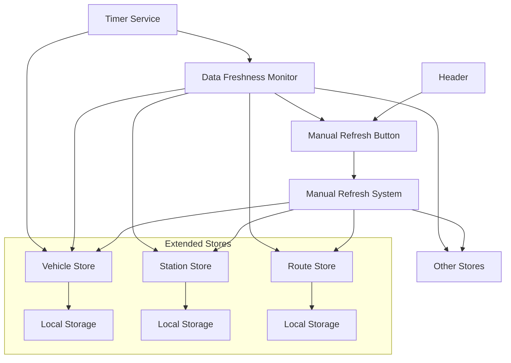

# Design Document: Manual Data Refresh

## Overview

The manual data refresh feature adds a user-controlled refresh mechanism with visual data freshness indicators. The design integrates seamlessly with the existing Zustand store architecture and Material-UI components, providing users with both manual control and automatic status awareness of their data freshness.

The system consists of three main components:
1. **Manual Refresh Button** - A header component that serves as both trigger and status indicator
2. **Data Freshness Monitor** - A utility that calculates freshness status from store timestamps  
3. **Store Extensions** - Direct extensions to existing Zustand stores for consistent data management

## Architecture

### Component Integration



### Data Flow

1. **Manual Refresh**: User clicks button → System triggers all store refresh methods → Stores fetch data → UI updates
2. **Automatic Monitoring**: Timer service checks data freshness → Monitor calculates status → Button color updates
3. **Background Refresh**: Stores automatically refresh stale data → Monitor detects changes → Button reflects new status

## Components and Interfaces

### Manual Refresh Button Component

```typescript
interface ManualRefreshButtonProps {
  className?: string;
  disabled?: boolean;
}

interface DataFreshnessStatus {
  status: 'fresh' | 'stale';
  vehicleDataAge: number;
  generalDataAge: number;
  isRefreshing: boolean;
  nextVehicleRefresh: number; // seconds until next auto-refresh
}
```

**Key Features:**
- Color-coded status indicator (green for fresh, red for stale)
- Loading state during refresh operations
- Timer countdown for next vehicle refresh
- Disabled state to prevent concurrent operations

### Data Freshness Monitor

```typescript
interface DataFreshnessMonitor {
  calculateFreshness(): DataFreshnessStatus;
  subscribeToChanges(callback: (status: DataFreshnessStatus) => void): () => void;
}

interface StoreTimestamps {
  vehicles: number | null;
  stations: number | null;
  routes: number | null;
  // ... other stores
}
```

**Responsibilities:**
- Read timestamps from all stores
- Calculate freshness status based on defined thresholds
- Provide reactive updates when data changes (via Zustand subscriptions)
- Operate as pure calculator without side effects
- Update frequency: React to store changes + periodic check every 30 seconds for time-based staleness

### Store Extensions

The existing Zustand stores will be extended with the following properties and methods:

```typescript
// Extensions to existing store interfaces (e.g., VehicleStore, StationStore, etc.)
interface StoreExtensions<T> {
  // New properties for refresh feature
  lastUpdated: number | null;
  
  // Enhanced actions
  refreshData: () => Promise<void>; // Force refresh regardless of freshness
  
  // Local storage integration
  persistToStorage: () => void;
  loadFromStorage: () => void;
}
```

**Implementation Notes:**
- `lastUpdated` will be added to existing stores alongside current `loading` and `error` states
- `isDataFresh()` method already exists in vehicleStore and will be added to other stores
- `refreshData()` will be a new method that forces data fetching regardless of current freshness
- Local storage methods will handle persistence with consistent naming pattern

## Data Models

### Freshness Thresholds

```typescript
const FRESHNESS_THRESHOLDS = {
  VEHICLES: 5 * 60 * 1000,      // 5 minutes
  GENERAL_DATA: 24 * 60 * 60 * 1000, // 24 hours
} as const;

const AUTO_REFRESH_INTERVALS = {
  VEHICLES: 60 * 1000,          // 1 minute when in foreground
  STARTUP_DELAY: 2000,          // 2 seconds after app start
  FRESHNESS_CHECK: 30 * 1000,   // 30 seconds for time-based staleness detection
} as const;
```

### Local Storage Schema

```typescript
interface StoredData<T> {
  data: T[];
  timestamp: number;
  version: string; // For cache invalidation
}

// Storage keys follow pattern: 'neary_cache_{storeName}'
const STORAGE_KEYS = {
  VEHICLES: 'neary_cache_vehicles',
  STATIONS: 'neary_cache_stations',
  ROUTES: 'neary_cache_routes',
  // ... other stores
} as const;
```

## Correctness Properties

*A property is a characteristic or behavior that should hold true across all valid executions of a system-essentially, a formal statement about what the system should do. Properties serve as the bridge between human-readable specifications and machine-verifiable correctness guarantees.*

### Property 1: Manual Refresh Triggers All Stores
*For any* application state, when the manual refresh button is clicked, all stores should attempt to fetch fresh data from their respective sources.
**Validates: Requirements 1.1**

### Property 2: Successful Refresh Updates All Stores
*For any* successful API response, when manual refresh completes successfully, all stores should contain fresh data and trigger UI updates.
**Validates: Requirements 1.2**

### Property 3: Network Failure Preserves Cache
*For any* network failure scenario, when manual refresh fails due to connectivity issues, existing cached data should remain unchanged and network status should be reported.
**Validates: Requirements 1.3**

### Property 4: Button Provides Loading Feedback
*For any* refresh operation, the manual refresh button should display loading state during the operation and return to normal state when complete.
**Validates: Requirements 1.4, 8.2, 8.3**

### Property 5: Button Color Reflects Data Freshness
*For any* data state, the manual refresh button color should accurately reflect the current data freshness status (green for fresh, red for stale when any data exceeds thresholds).
**Validates: Requirements 1.5, 2.1, 2.2, 2.3, 2.5**

### Property 6: Timer Countdown Display
*For any* foreground application state, the manual refresh button should display a visual countdown to the next automatic vehicle refresh.
**Validates: Requirements 2.6**

### Property 7: Freshness Monitor Reads Store Timestamps
*For any* store state, the data freshness monitor should be able to read timestamps from all stores without modifying any data.
**Validates: Requirements 3.1, 3.5**

### Property 8: Staleness Calculation Accuracy
*For any* timestamp older than the defined thresholds (5 minutes for vehicles, 24 hours for general data), the freshness monitor should correctly calculate the data as stale.
**Validates: Requirements 3.2, 3.3**

### Property 9: Continuous Freshness Monitoring
*For any* data change in stores, the freshness monitor should detect the change and update the button color accordingly within a reasonable time frame (using reactive subscriptions to store changes rather than polling).
**Validates: Requirements 3.4**

### Property 10: Local Storage Persistence
*For any* successful data fetch, stores should immediately persist the data to local storage with accurate timestamps.
**Validates: Requirements 4.1**

### Property 11: Offline Data Serving
*For any* network unavailable state, stores should serve data from local storage when requested.
**Validates: Requirements 4.2, 5.3**

### Property 12: Cache-First Startup Strategy
*For any* application startup, stores should display cached data immediately (if available) while fetching fresh data in the background.
**Validates: Requirements 7.1**

### Property 13: Automatic Vehicle Refresh Timer
*For any* foreground application state, the vehicle store should automatically fetch fresh data every 1 minute.
**Validates: Requirements 7.2**

### Property 14: Startup Data Loading Priority
*For any* application startup with network connectivity, vehicle data loading should be prioritized over general data loading.
**Validates: Requirements 5.4**

### Property 15: Automatic Stale Data Refresh
*For any* data that becomes stale while network is available, the respective store should automatically fetch fresh data.
**Validates: Requirements 7.5**

### Property 16: First Load Loading States
*For any* first application load with empty cache, stores should display loading states until background fetch completes.
**Validates: Requirements 7.6**

### Property 17: Seamless Background Updates
*For any* background data fetch completion, UI components should update seamlessly without interrupting ongoing user interactions.
**Validates: Requirements 7.7**

## Error Handling

### Network Connectivity Issues
- **Detection**: Use existing network status monitoring from StatusStore
- **Response**: Preserve cached data, update network indicators, disable refresh button temporarily
- **Recovery**: Automatically attempt refresh when connectivity is restored

### API Failures
- **Timeout Handling**: 10-second timeout for refresh operations
- **Retry Logic**: Single retry attempt after 2-second delay
- **User Feedback**: Show error state in button, preserve existing data

### Local Storage Issues
- **Storage Full**: Implement LRU cache eviction for oldest data
- **Corruption**: Graceful fallback to empty state, trigger fresh fetch
- **Access Denied**: Log error, continue with memory-only operation

### Data Integrity
- **Version Mismatch**: Clear cache if stored data version doesn't match current app version
- **Timestamp Validation**: Reject data with future timestamps or invalid values
- **Schema Validation**: Validate stored data structure before loading

## Testing Strategy

### Unit Testing
- **Component Testing**: Test Manual Refresh Button states, colors, and interactions
- **Monitor Testing**: Test Data Freshness Monitor calculations with various timestamp scenarios
- **Store Testing**: Test enhanced store methods for data persistence and loading
- **Error Scenarios**: Test network failures, storage issues, and API errors

### Property-Based Testing
- **Freshness Calculations**: Generate random timestamps and verify correct staleness determination
- **Store Consistency**: Test data integrity between memory and local storage across random operations
- **Refresh Behavior**: Test manual refresh with various network and data states
- **Timer Accuracy**: Test automatic refresh timing with different foreground/background states

**Configuration**: Each property test runs minimum 100 iterations using Vitest with fast-check library. Tests are tagged with format: **Feature: manual-data-refresh, Property {number}: {property_text}**

### Integration Testing
- **End-to-End Refresh**: Test complete refresh cycle from button click to UI update
- **Startup Scenarios**: Test various startup conditions (online/offline, with/without cache)
- **Cross-Store Coordination**: Test that all stores participate in manual refresh operations
- **Timer Integration**: Test interaction between manual refresh and automatic refresh timers