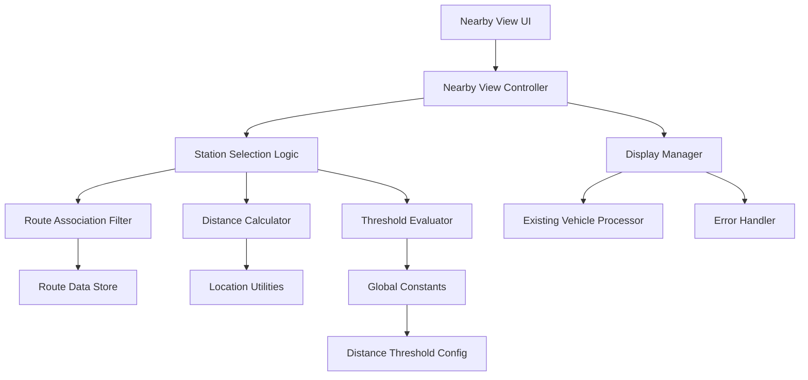

# Nearby View Stabilization Design Document

## Overview

The Nearby View Stabilization system enhances the existing nearby station display functionality by implementing robust station selection logic, configurable distance thresholds, and improved stability. The system focuses on displaying the most relevant stations based on route associations and geographic proximity while maintaining backward compatibility with existing vehicle processing infrastructure.

The design emphasizes separation of concerns between station selection logic and display logic, enabling better testability and maintainability. The system introduces a global constant for distance threshold configuration and implements intelligent station filtering based on route associations.

## Architecture

### High-Level Architecture



### Component Interaction Flow

1. **Station Selection Phase**: Filter stations by route associations and calculate distances
2. **Threshold Evaluation Phase**: Apply distance threshold to determine second station eligibility
3. **Display Preparation Phase**: Integrate with existing vehicle processing for display data
4. **Rendering Phase**: Present stations with vehicles and route information

## Components and Interfaces

### Core Components

#### 1. Station Selection Logic
- **Purpose**: Implements the core logic for identifying qualifying stations
- **Responsibilities**: Route association filtering, distance calculations, threshold evaluation
- **Interface**: Pure functions that can be tested independently

#### 2. Distance Threshold Manager
- **Purpose**: Manages the global distance threshold constant
- **Responsibilities**: Provides consistent access to threshold value, enables configuration
- **Interface**: Exports constant and utility functions

#### 3. Nearby View Controller
- **Purpose**: Orchestrates station selection and display preparation
- **Responsibilities**: Coordinates between selection logic and existing vehicle processing
- **Interface**: Integrates with existing useVehicleProcessing hook

#### 4. Route Association Filter
- **Purpose**: Determines which stations have valid route relationships
- **Responsibilities**: Filters stations based on route data availability
- **Interface**: Pure function for route association validation

### Data Interfaces

```typescript
// Global Constants
export const NEARBY_STATION_DISTANCE_THRESHOLD = 200; // meters

// Station Selection Interfaces
interface StationSelectionCriteria {
  userLocation: Coordinates;
  availableStations: Station[];
  routeData: Route[];
  maxSearchRadius?: number;
}

interface StationSelectionResult {
  closestStation: StationWithRoutes | null;
  secondStation: StationWithRoutes | null;
  rejectedStations: Array<{
    station: Station;
    rejectionReason: 'no_routes' | 'too_far' | 'threshold_exceeded';
  }>;
}

interface StationWithRoutes extends Station {
  associatedRoutes: Route[];
  distanceFromUser: number;
}

// Route Association Interfaces
interface RouteAssociation {
  stationId: string;
  routeIds: string[];
  hasActiveRoutes: boolean;
}

interface RouteAssociationResult {
  hasRoutes: boolean;
  associatedRoutes: Route[];
  routeCount: number;
}

// Distance Calculation Interfaces
interface DistanceCalculationResult {
  distance: number;
  withinThreshold: boolean;
  calculationMethod: 'haversine' | 'fallback';
}

interface StationDistanceInfo {
  station: Station;
  distanceFromUser: number;
  distanceBetweenStations?: number;
}
```

### Integration Interfaces

```typescript
// Clean integration with existing vehicle processing
interface NearbyViewOptions {
  enableSecondStation?: boolean;
  customDistanceThreshold?: number;
  stabilityMode?: 'strict' | 'normal' | 'flexible';
  maxSearchRadius?: number;
  maxVehiclesPerStation?: number;
}

interface NearbyViewResult {
  selectedStations: StationSelectionResult;
  stationVehicleGroups: StationVehicleGroup[];
  isLoading: boolean;
  effectiveLocationForDisplay: Coordinates | null;
  thresholdUsed: number;
  selectionMetadata: {
    totalStationsEvaluated: number;
    stationsWithRoutes: number;
    selectionTime: number;
  };
  error?: NearbyViewError;
}
```

## Data Models

### Station Selection Model

```typescript
class StationSelector {
  constructor(
    private distanceThreshold: number = NEARBY_STATION_DISTANCE_THRESHOLD,
    private maxSearchRadius: number = 5000
  ) {}

  selectStations(criteria: StationSelectionCriteria): StationSelectionResult {
    // Implementation details in components section
  }

  private filterStationsByRoutes(
    stations: Station[], 
    routes: Route[]
  ): StationWithRoutes[] {
    // Filter stations that have associated routes
  }

  private calculateStationDistances(
    stations: StationWithRoutes[], 
    userLocation: Coordinates
  ): StationDistanceInfo[] {
    // Calculate distances and sort by proximity
  }

  private evaluateSecondStation(
    closestStation: StationWithRoutes,
    candidates: StationDistanceInfo[]
  ): StationWithRoutes | null {
    // Apply distance threshold logic
  }
}
```

### Distance Threshold Configuration

```typescript
// Global constants file (src/utils/nearbyViewConstants.ts)
export const NEARBY_STATION_DISTANCE_THRESHOLD = 200; // meters
export const MAX_NEARBY_SEARCH_RADIUS = 5000; // meters
export const STATION_STABILITY_THRESHOLD = 50; // meters for stability

// Utility functions
export const isWithinNearbyThreshold = (
  distance: number, 
  threshold: number = NEARBY_STATION_DISTANCE_THRESHOLD
): boolean => {
  return distance <= threshold;
};

export const calculateStationProximity = (
  station1: Station, 
  station2: Station
): number => {
  return calculateDistance(station1.coordinates, station2.coordinates);
};
```

### Error Handling Model

```typescript
enum NearbyViewErrorType {
  NO_GPS_LOCATION = 'no_gps_location',
  NO_STATIONS_IN_RANGE = 'no_stations_in_range',
  NO_ROUTES_AVAILABLE = 'no_routes_available',
  DISTANCE_CALCULATION_FAILED = 'distance_calculation_failed',
  DATA_LOADING_ERROR = 'data_loading_error'
}

interface NearbyViewError {
  type: NearbyViewErrorType;
  message: string;
  fallbackAction?: 'show_message' | 'retry' | 'use_cached_data';
  context?: Record<string, any>;
}
```

## Correctness Properties

*A property is a characteristic or behavior that should hold true across all valid executions of a system—essentially, a formal statement about what the system should do. Properties serve as the bridge between human-readable specifications and machine-verifiable correctness guarantees.*

Based on the prework analysis and property reflection, the following correctness properties ensure the system behaves correctly across all valid inputs:

### Property 1: Closest station identification accuracy
*For any* valid GPS position and station set with route associations, the identified closest station should be the one with minimum distance from the user location among stations that have routes
**Validates: Requirements 1.1, 1.2**

### Property 2: Route association filtering consistency
*For any* station set, only stations that have at least one associated route should be considered for display, regardless of live vehicle presence
**Validates: Requirements 1.2, 1.3, 2.2**

### Property 3: Distance threshold application
*For any* closest station and candidate second station, the second station should only be displayed when the distance between stations is less than or equal to the configured threshold
**Validates: Requirements 2.4, 2.5**

### Property 4: Global constant consistency
*For any* distance threshold calculation throughout the system, the same global constant value should be used consistently
**Validates: Requirements 3.4**

### Property 5: Vehicle association completeness
*For any* displayed station, all vehicles currently associated with that station should be included in the display data
**Validates: Requirements 4.1**

### Property 6: Route grouping accuracy
*For any* set of vehicles at a station, vehicles should be correctly grouped by their route identifiers
**Validates: Requirements 4.2**

### Property 7: Station display without vehicles
*For any* station with route associations but no live vehicles, the station should still be displayed with its route information
**Validates: Requirements 4.3, 4.4**

### Property 8: GPS position stability
*For any* small GPS position change (within stability threshold), the station selection should remain stable unless a significantly better option becomes available
**Validates: Requirements 5.1**

### Property 9: Clean integration with vehicle processing
*For any* vehicle processing integration, the nearby view system should work seamlessly with existing vehicle data without requiring legacy compatibility layers
**Validates: Requirements 6.5**

### Property 10: Single station display behavior
*For any* scenario where no second station meets the distance threshold, only the closest station should be displayed without indicating missing information
**Validates: Requirements 7.5**

## Error Handling

### Error Classification and Response

#### Location Errors
- **No GPS Available**: Display location permission request message
- **Invalid Coordinates**: Use fallback location or show setup prompt
- **Location Permission Denied**: Provide clear instructions for enabling location

#### Data Errors
- **No Stations in Range**: Show "no nearby stations" message with range information
- **No Route Associations**: Display "no active routes" message with suggestion to check later
- **Missing Route Data**: Gracefully degrade to basic station display

#### Calculation Errors
- **Distance Calculation Failed**: Use fallback distance estimation or skip problematic stations
- **Threshold Evaluation Error**: Default to showing only closest station

#### Integration Errors
- **Vehicle Processing Failure**: Show stations without vehicle data, indicate limited information
- **API Data Unavailable**: Use cached data with staleness indicator

### Fallback Strategies

1. **Progressive Degradation**: Show available information even when some data is missing
2. **Cached Data Usage**: Use last known good data with appropriate indicators
3. **Simplified Display**: Fall back to basic station list when advanced features fail
4. **User Guidance**: Provide clear instructions for resolving configuration issues

## Testing Strategy

### Dual Testing Approach

The application uses both unit testing and property-based testing for comprehensive coverage:

#### Unit Testing with Vitest
- **Station Selection Logic**: Test specific scenarios with known station configurations
- **Distance Calculations**: Verify accuracy with known coordinate pairs
- **Threshold Evaluation**: Test boundary conditions and edge cases
- **Error Handling**: Validate error responses for specific failure scenarios
- **Integration Points**: Test compatibility with existing vehicle processing

#### Property-Based Testing with fast-check
- **Library**: fast-check for TypeScript property-based testing
- **Iterations**: Minimum 100 iterations per property test to ensure statistical confidence
- **Generators**: Custom generators for GPS coordinates, station arrays, route data, and distance values
- **Property Tagging**: Each property test tagged with format: `**Feature: nearby-view-stabilization, Property X: [property description]**`

#### Testing Requirements
- Each correctness property must be implemented by a single property-based test
- Property tests verify universal behaviors across all valid inputs
- Unit tests catch specific bugs and validate concrete examples
- All tests must pass before deployment
- Test coverage minimum: 85% for station selection logic, 70% overall

### Test Data Generation Strategy

#### Smart Generators
- **GPS Coordinates Generator**: Produces valid latitude/longitude pairs within Cluj-Napoca bounds
- **Station Array Generator**: Creates realistic station distributions with varying route associations
- **Route Data Generator**: Generates route information with consistent station relationships
- **Distance Threshold Generator**: Produces valid threshold values for boundary testing

#### Generator Constraints
- GPS coordinates constrained to Cluj-Napoca metropolitan area (±0.1 degrees from city center)
- Station distances constrained to realistic urban ranges (50m to 10km from user)
- Route associations constrained to valid route-station relationships
- Distance thresholds constrained to practical values (50m to 1000m)

### Performance Testing
- **Station Selection Performance**: Ensure selection completes within 100ms for typical data sets
- **Memory Usage**: Monitor memory consumption with large station arrays
- **Stability Testing**: Verify consistent behavior with rapid GPS position changes