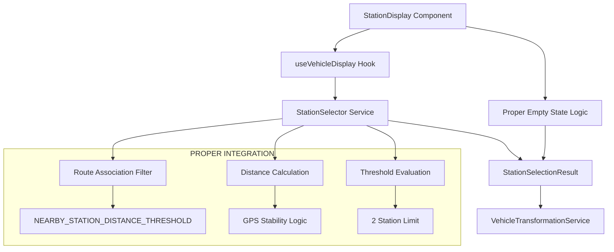

# StationDisplay Architecture Alignment Design Document

## Overview

This design addresses critical architectural misalignments in the StationDisplay component by ensuring it properly integrates with the established nearby-view-stabilization architecture. The current implementation bypasses the StationSelector service and implements its own flawed station selection logic, leading to incorrect behavior and inconsistent user experience.

The solution involves refactoring both StationDisplay and useVehicleDisplay to use the proper nearby view architecture, including StationSelector for station selection, proper distance threshold evaluation, GPS stability logic, and accurate empty state messaging.

## Architecture

### Current Architecture Problems

```mermaid
graph TB
    StationDisplay[StationDisplay Component] --> useVehicleDisplay[useVehicleDisplay Hook]
    useVehicleDisplay --> DirectSlicing[allStations.slice(0, 3)]
    useVehicleDisplay --> TransformationService[VehicleTransformationService]
    
    StationDisplay --> EmptyStateLogic[Custom Empty State Logic]
    EmptyStateLogic --> allStationsFromHook[Raw Station Data]
    
    subgraph "PROBLEMS"
        DirectSlicing --> Problem1[❌ Bypasses StationSelector]
        allStationsFromHook --> Problem2[❌ Wrong data for empty state]
        Problem1 --> Problem3[❌ No distance threshold logic]
        Problem2 --> Problem4[❌ Shows wrong stations in messages]
    end
    
    subgraph "UNUSED PROPER ARCHITECTURE"
        StationSelector[StationSelector Service]
        NearbyConstants[Nearby View Constants]
        GPSStability[GPS Stability Logic]
    end
```

### Target Architecture Solution



## Components and Interfaces

### 1. StationSelector Integration

#### Modified useVehicleDisplay Hook
```typescript
interface UseVehicleDisplayOptions {
  filterByFavorites?: boolean;
  maxStations?: number; // Will be limited to 2 max
  maxVehiclesPerStation?: number;
  showAllVehiclesPerRoute?: boolean;
}

interface UseVehicleDisplayResult {
  stationVehicleGroups: StationVehicleGroup[];
  transformedData: TransformedVehicleData | null;
  stationSelectionResult: StationSelectionResult | null; // NEW: Expose selection result
  isLoading: boolean;
  effectiveLocationForDisplay: Coordinates | null;
  error?: StandardError;
}
```

#### StationSelector Integration Pattern
```typescript
// In useVehicleDisplay
const stationSelectionResult = useMemo(() => {
  if (!effectiveLocationForDisplay || allStations.length === 0 || routes.length === 0) {
    return null;
  }

  const criteria: StationSelectionCriteria = {
    userLocation: effectiveLocationForDisplay,
    availableStations: allStations,
    routeData: routes,
    stopTimesData: stopTimes, // If available
    tripsData: trips, // If available
    maxSearchRadius: 5000 // 5km search radius
  };

  return stationSelector.selectStations(criteria);
}, [effectiveLocationForDisplay, allStations, routes, stopTimes, trips]);
```

### 2. Transformation Context Update

#### Proper Station Selection for Context
```typescript
// Replace direct slicing with proper selection
const transformationContext = useMemo((): TransformationContext | null => {
  if (!apiKey || !agencyId || !stationSelectionResult) {
    return null;
  }

  const context = createDefaultTransformationContext(apiKey, agencyId);
  
  // Use properly selected stations instead of slice(0, maxStations)
  const selectedStations: TransformationStation[] = [];
  
  if (stationSelectionResult.closestStation) {
    selectedStations.push(convertToTransformationStation(stationSelectionResult.closestStation));
  }
  
  if (stationSelectionResult.secondStation) {
    selectedStations.push(convertToTransformationStation(stationSelectionResult.secondStation));
  }
  
  context.targetStations = selectedStations;
  
  return context;
}, [apiKey, agencyId, stationSelectionResult]);
```

### 3. Empty State Logic Correction

#### Proper Empty State Data Source
```typescript
// In StationDisplay component
const checkedStationsInfo = useMemo(() => {
  if (isLoading || !stationSelectionResult) {
    return null;
  }

  const checkedStations: Array<{ name: string; routeCount: number; distance: number }> = [];
  
  // Use stations that were actually evaluated by StationSelector
  if (stationSelectionResult.closestStation) {
    checkedStations.push({
      name: stationSelectionResult.closestStation.name,
      routeCount: stationSelectionResult.closestStation.associatedRoutes.length,
      distance: stationSelectionResult.closestStation.distanceFromUser
    });
  }
  
  if (stationSelectionResult.secondStation) {
    checkedStations.push({
      name: stationSelectionResult.secondStation.name,
      routeCount: stationSelectionResult.secondStation.associatedRoutes.length,
      distance: stationSelectionResult.secondStation.distanceFromUser
    });
  }
  
  // Include rejected stations for context (optional)
  const nearbyRejectedStations = stationSelectionResult.rejectedStations
    .filter(rejected => rejected.rejectionReason === 'threshold_exceeded')
    .slice(0, 2) // Show up to 2 additional nearby stations
    .map(rejected => ({
      name: rejected.station.name,
      routeCount: rejected.station.routes?.length || 0,
      distance: calculateDistance(effectiveLocationForDisplay!, rejected.station.coordinates)
    }));
  
  checkedStations.push(...nearbyRejectedStations);
  
  // Sort by distance
  return checkedStations.sort((a, b) => a.distance - b.distance);
}, [stationSelectionResult, isLoading, effectiveLocationForDisplay]);
```

## Data Models

### Enhanced Station Selection Integration

```typescript
// Enhanced useVehicleDisplay result
interface UseVehicleDisplayResult {
  // Existing properties
  stationVehicleGroups: StationVehicleGroup[];
  transformedData: TransformedVehicleData | null;
  isLoading: boolean;
  effectiveLocationForDisplay: Coordinates | null;
  
  // NEW: Station selection information
  stationSelectionResult: StationSelectionResult | null;
  stationSelectionMetadata: {
    totalStationsEvaluated: number;
    stationsWithRoutes: number;
    stationsInRadius: number;
    selectionTime: number;
    thresholdUsed: number;
  } | null;
  
  error?: StandardError;
}

// Station selection metadata for debugging and empty states
interface StationSelectionMetadata {
  totalStationsEvaluated: number;
  stationsWithRoutes: number;
  stationsInRadius: number;
  rejectedByDistance: number;
  rejectedByThreshold: number;
  rejectedByRoutes: number;
  selectionTime: number;
  thresholdUsed: number;
  stabilityApplied: boolean;
}
```

### GPS Stability Integration

```typescript
// GPS stability state management
interface GPSStabilityState {
  lastSignificantLocation: Coordinates | null;
  lastStationSelection: StationSelectionResult | null;
  stabilityMaintained: boolean;
  lastSelectionTime: number;
}

// Stability evaluation function
const evaluateLocationStability = (
  newLocation: Coordinates,
  previousState: GPSStabilityState
): { shouldReselect: boolean; updatedState: GPSStabilityState } => {
  if (!previousState.lastSignificantLocation) {
    return {
      shouldReselect: true,
      updatedState: {
        lastSignificantLocation: newLocation,
        lastStationSelection: null,
        stabilityMaintained: false,
        lastSelectionTime: Date.now()
      }
    };
  }

  const isSignificant = isSignificantLocationChange(
    previousState.lastSignificantLocation,
    newLocation,
    STATION_STABILITY_THRESHOLD
  );

  if (isSignificant) {
    return {
      shouldReselect: true,
      updatedState: {
        lastSignificantLocation: newLocation,
        lastStationSelection: previousState.lastStationSelection,
        stabilityMaintained: false,
        lastSelectionTime: Date.now()
      }
    };
  }

  return {
    shouldReselect: false,
    updatedState: {
      ...previousState,
      stabilityMaintained: true
    }
  };
};
```

## Correctness Properties

*A property is a characteristic or behavior that should hold true across all valid executions of a system—essentially, a formal statement about what the system should do. Properties serve as the bridge between human-readable specifications and machine-verifiable correctness guarantees.*

<function_calls>
<invoke name="prework">
<parameter name="featureName">station-display-architecture-alignment

Based on the prework analysis and property reflection, the following correctness properties ensure the architectural alignment behaves correctly:

### Property 1: StationSelector service usage consistency
*For any* station selection scenario in StationDisplay, the StationSelector.selectStations() method should be used instead of direct station manipulation
**Validates: Requirements 1.1, 1.2, 1.3**

### Property 2: Distance threshold application accuracy
*For any* station pair evaluation, the NEARBY_STATION_DISTANCE_THRESHOLD (200m) should be used consistently for second station determination
**Validates: Requirements 2.1, 2.2, 2.3, 7.2**

### Property 3: Route association filtering completeness
*For any* station set, only stations with route associations should be considered for display regardless of proximity
**Validates: Requirements 3.1, 3.2, 3.3, 3.5**

### Property 4: Two-station display limit enforcement
*For any* station selection result, never more than 2 stations (closest + optional second) should be displayed
**Validates: Requirements 2.5, 6.4**

### Property 5: GPS stability maintenance
*For any* GPS position change within STATION_STABILITY_THRESHOLD, the current station selection should be maintained
**Validates: Requirements 4.1, 4.2, 4.4**

### Property 6: Empty state accuracy
*For any* empty state scenario, the displayed station information should reflect stations actually evaluated by StationSelector
**Validates: Requirements 5.1, 5.2, 5.3, 5.4**

### Property 7: Transformation context correctness
*For any* transformation context creation, properly selected stations should be used instead of raw station slicing
**Validates: Requirements 6.1, 6.2**

### Property 8: Hardcoded logic elimination
*For any* station processing operation, StationSelector should handle the logic instead of custom implementations
**Validates: Requirements 8.1, 8.2, 8.3, 8.4**

## Error Handling

### Station Selection Errors

#### No Stations Available
- **Scenario**: StationSelector returns null for both closest and second station
- **Response**: Display "No nearby stations found" with search radius information
- **Fallback**: Suggest checking location permissions or expanding search area

#### No Route Associations
- **Scenario**: All nearby stations lack route associations
- **Response**: Display "No active routes available" with station names that were checked
- **Fallback**: Suggest checking back later or contacting transit authority

#### GPS Stability Issues
- **Scenario**: Rapid GPS position changes causing instability
- **Response**: Use stability threshold to maintain current selection
- **Fallback**: If stability cannot be maintained, show loading state during transitions

### Integration Errors

#### StationSelector Service Failure
- **Scenario**: StationSelector.selectStations() throws an error
- **Response**: Log error details and fall back to simple nearest station logic
- **Fallback**: Use basic distance sorting without route association filtering

#### Transformation Context Creation Failure
- **Scenario**: Cannot create proper transformation context with selected stations
- **Response**: Log error and use fallback context with basic station data
- **Fallback**: Maintain basic functionality while logging issue for investigation

### Data Consistency Errors

#### Station Data Mismatch
- **Scenario**: StationSelectionResult contains stations not in original data set
- **Response**: Validate station IDs and filter out invalid entries
- **Fallback**: Use intersection of selection result and available stations

#### Route Association Data Missing
- **Scenario**: Station has routes property but route data is unavailable
- **Response**: Use station.routes property as fallback for route association
- **Fallback**: Assume station has routes if routes property exists and is non-empty

## Testing Strategy

### Dual Testing Approach

The application uses both unit testing and property-based testing for comprehensive coverage:

#### Unit Testing with Vitest
- **StationSelector Integration**: Test specific integration scenarios with known data
- **Empty State Logic**: Verify correct empty state messages for specific scenarios
- **GPS Stability**: Test stability behavior with known position changes
- **Error Handling**: Validate error responses for specific failure conditions
- **Component Integration**: Test StationDisplay and useVehicleDisplay integration

#### Property-Based Testing with fast-check
- **Library**: fast-check for TypeScript property-based testing
- **Iterations**: Minimum 100 iterations per property test to ensure statistical confidence
- **Generators**: Custom generators for GPS coordinates, station arrays, route data, and selection results
- **Property Tagging**: Each property test tagged with format: `**Feature: station-display-architecture-alignment, Property X: [property description]**`

#### Testing Requirements
- Each correctness property must be implemented by a single property-based test
- Property tests verify universal behaviors across all valid inputs
- Unit tests catch specific bugs and validate concrete examples
- All tests must pass before deployment
- Test coverage minimum: 90% for station selection integration, 80% overall

### Test Data Generation Strategy

#### Smart Generators
- **Station Selection Results Generator**: Creates realistic StationSelectionResult objects with valid closest/second stations
- **GPS Position Generator**: Produces valid coordinate sequences with controlled stability patterns
- **Route Association Generator**: Creates stations with varying route association patterns
- **Empty State Scenario Generator**: Generates scenarios that should trigger different empty state messages

#### Generator Constraints
- Station selection results constrained to maximum 2 stations (closest + optional second)
- GPS position changes constrained to realistic urban movement patterns
- Route associations constrained to valid station-route relationships
- Distance thresholds constrained to NEARBY_STATION_DISTANCE_THRESHOLD (200m)

### Performance Testing
- **Station Selection Integration**: Ensure integration completes within 50ms for typical data sets
- **Memory Usage**: Monitor memory consumption with StationSelector integration
- **Stability Performance**: Verify GPS stability logic doesn't impact performance
- **Empty State Performance**: Ensure empty state message generation is fast

## Implementation Plan

### Phase 1: useVehicleDisplay Hook Refactoring
1. **Integrate StationSelector**: Replace direct station slicing with StationSelector.selectStations()
2. **Update Transformation Context**: Use selected stations instead of raw slicing
3. **Add Selection Result Exposure**: Expose StationSelectionResult in hook return
4. **Implement GPS Stability**: Add stability state management to prevent frequent reselection

### Phase 2: StationDisplay Component Updates
1. **Remove Hardcoded Logic**: Eliminate allStationsFromHook.slice(0, 3) and custom distance sorting
2. **Update Empty State Logic**: Use StationSelectionResult for empty state messages
3. **Add Selection Result Usage**: Use closestStation and secondStation from selection result
4. **Implement Error Handling**: Add proper error handling for selection failures

### Phase 3: Integration Testing and Validation
1. **End-to-End Testing**: Verify complete integration works correctly
2. **Performance Validation**: Ensure no performance regression from architectural changes
3. **Error Scenario Testing**: Test all error handling paths
4. **User Experience Validation**: Verify improved empty state messages and stability

### Phase 4: Cleanup and Documentation
1. **Remove Legacy Code**: Clean up any remaining hardcoded station selection logic
2. **Update Documentation**: Document the proper architectural patterns
3. **Add Performance Monitoring**: Monitor station selection performance in production
4. **Create Migration Guide**: Document changes for other components that might need similar updates