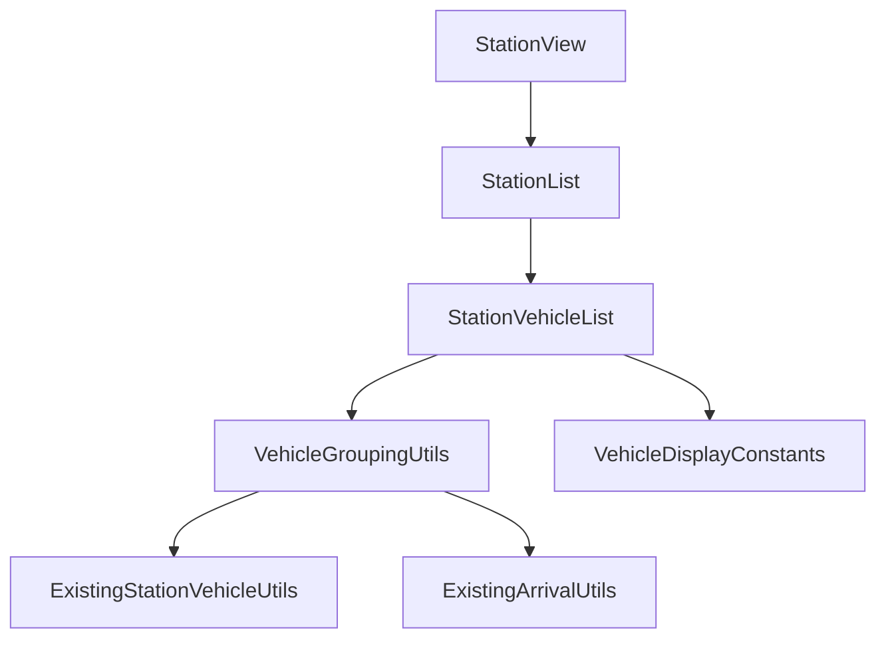
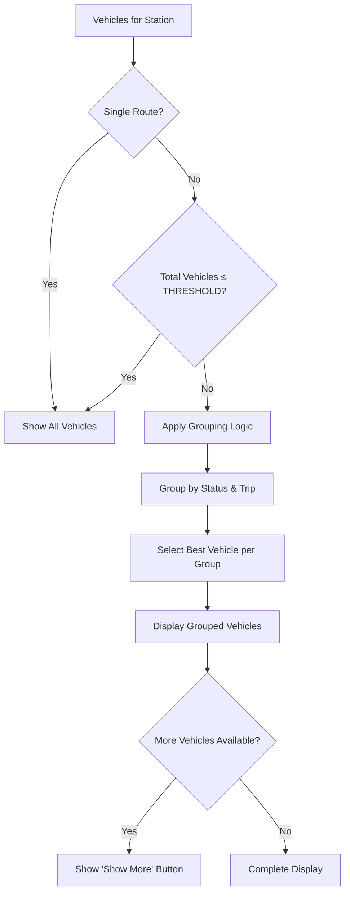

# Design Document: Station Vehicle Display Optimization

## Overview

This design optimizes the station vehicle list display by implementing intelligent grouping and expansion controls. The system will maintain the current architecture while adding new logic to filter and group vehicles based on station complexity, route count, and total vehicle count.

The solution extends the existing `StationVehicleList` component and related utilities to provide a cleaner user experience when stations have many vehicles across multiple routes, while preserving access to all vehicle information through expansion controls.

## Architecture

The design follows the existing clean architecture pattern with clear separation of concerns:

- **Components Layer**: Enhanced `StationVehicleList` with grouping and expansion logic
- **Utils Layer**: New vehicle grouping utilities and enhanced constants
- **Types Layer**: Extended interfaces for grouped vehicle display



## Components and Interfaces

### Enhanced StationVehicleList Component

The `StationVehicleList` component will be enhanced with:

```typescript
interface StationVehicleListProps {
  vehicles: StationVehicle[];
  expanded: boolean;
  onVehicleClick?: (vehicleId: number) => void;
  // New props for optimization
  stationRouteCount?: number;
}

interface VehicleDisplayState {
  isGrouped: boolean;
  showingAll: boolean;
  displayedVehicles: StationVehicle[];
  hiddenVehicleCount: number;
}
```

### New Vehicle Grouping Utilities

```typescript
// src/utils/station/vehicleGroupingUtils.ts
interface GroupedVehicles {
  displayed: StationVehicle[];
  hidden: StationVehicle[];
  groupingApplied: boolean;
}

interface VehicleGroupingOptions {
  maxVehicles: number;
  routeCount: number;
}

export const groupVehiclesForDisplay = (
  vehicles: StationVehicle[],
  options: VehicleGroupingOptions
): GroupedVehicles;

export const selectBestVehiclePerStatus = (
  vehicles: StationVehicle[],
  status: ArrivalStatus
): StationVehicle | null;
```

## Data Models

### Extended Constants

```typescript
// src/utils/core/constants.ts - additions
export const VEHICLE_DISPLAY = {
  // Maximum vehicles before applying grouping logic
  VEHICLE_DISPLAY_THRESHOLD: 5,
  
  // Maximum vehicles per route per status in grouped mode
  MAX_VEHICLES_PER_ROUTE_STATUS: 1,
} as const;
```

### Vehicle Display Logic Flow



## Correctness Properties

*A property is a characteristic or behavior that should hold true across all valid executions of a system-essentially, a formal statement about what the system should do. Properties serve as the bridge between human-readable specifications and machine-verifiable correctness guarantees.*

### Property 1: Single Route Display Logic
*For any* station with exactly one route, all vehicles should be displayed regardless of vehicle count
**Validates: Requirements 1.1**

### Property 2: Multi-Route Threshold Logic
*For any* station with multiple routes, if total vehicles is at or below VEHICLE_DISPLAY_THRESHOLD then all vehicles should be displayed, otherwise grouped display logic should be applied
**Validates: Requirements 1.2, 1.3**

### Property 3: Status-Based Vehicle Grouping
*For any* grouped display scenario, there should be at most one vehicle displayed per trip per status category (at_stop, arriving_soon, in_minutes, just_left, departed)
**Validates: Requirements 2.1, 2.2, 2.3, 2.4, 2.5**

### Property 4: Earliest Vehicle Selection Priority
*For any* group of vehicles with the same trip and status, the vehicle with the earliest arrival time should be selected for display
**Validates: Requirements 2.6**

### Property 5: Initial Display Count Limit
*For any* grouped display scenario, the initial number of displayed vehicles should not exceed VEHICLE_DISPLAY_THRESHOLD
**Validates: Requirements 3.1**


## Error Handling

The system will handle edge cases gracefully:

- **Empty Vehicle Lists**: Display appropriate empty state messages
- **Invalid Vehicle Data**: Skip vehicles with missing required fields
- **Network Failures**: Maintain last known state and show appropriate indicators
- **Invalid Threshold Values**: Fall back to default value of 5 with console warning

Error boundaries will be implemented at the component level to prevent crashes from propagating to the entire application.

## Testing Strategy

### Dual Testing Approach

The implementation will use both unit tests and property-based tests for comprehensive coverage:

**Unit Tests** will focus on:
- Specific examples of grouping logic with known inputs
- Edge cases like empty vehicle lists or single vehicles
- Integration points between components
- UI interaction behaviors (expansion/collapse)

**Property-Based Tests** will focus on:
- Universal properties that hold across all vehicle combinations
- Comprehensive input coverage through randomization
- Validation of correctness properties across many scenarios

### Property-Based Testing Configuration

- **Framework**: Vitest with fast-check for property-based testing
- **Minimum iterations**: 100 per property test
- **Test tagging**: Each property test will reference its design document property
- **Tag format**: `Feature: station-vehicle-display-optimization, Property {number}: {property_text}`

### Test Data Generation

Smart generators will be created for:
- **Vehicle Sets**: Generate realistic vehicle combinations with various statuses
- **Station Configurations**: Generate stations with different route counts
- **Arrival Times**: Generate realistic arrival time distributions
- **Edge Cases**: Ensure generators include boundary conditions and error states

The testing strategy ensures that both concrete examples work correctly (unit tests) and that the general rules hold across all possible inputs (property tests).