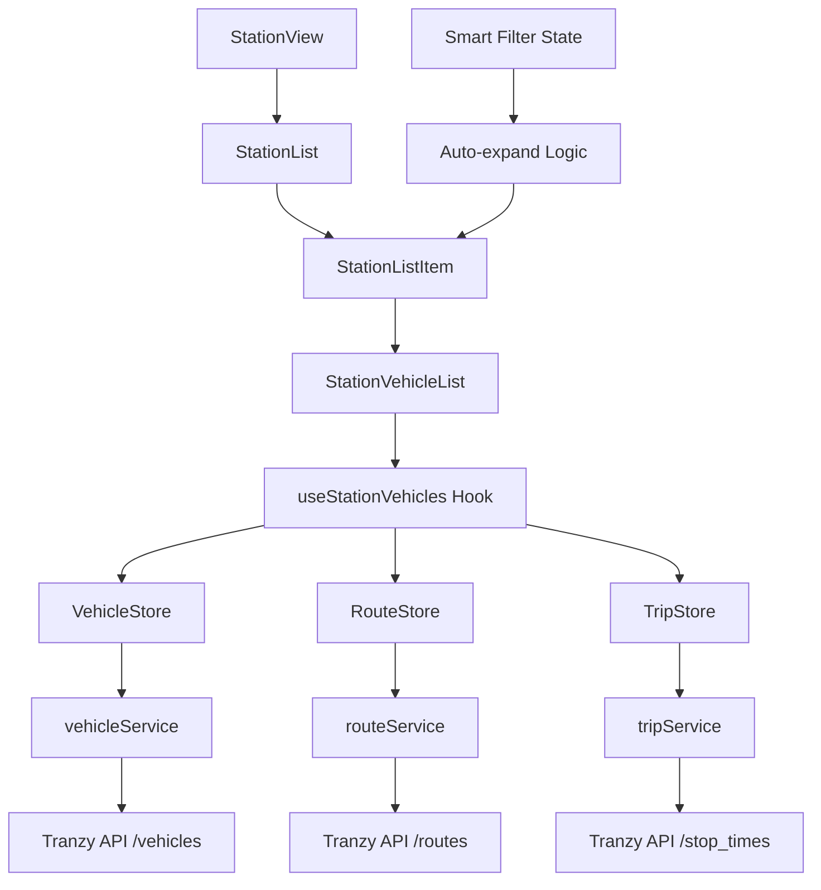

# Design Document

## Overview

The Station Vehicle List feature extends the existing station view by adding expandable vehicle lists under each station. The feature leverages existing services and stores to display real-time vehicles serving routes that pass through each station. The design follows the clean architecture patterns established in the codebase, using raw API data without transformations and maintaining component sizes under 150 lines.

## Architecture

The feature integrates seamlessly with the existing station view architecture:

```
StationView (existing)
├── StationViewHeader (existing)
├── StationList (existing)
│   └── StationListItem (enhanced)
│       ├── Station Details (existing)
│       └── StationVehicleList (new)
│           ├── Vehicle Loading State
│           ├── Vehicle List Items
│           └── Empty/Error States
└── StationEmptyState (existing)
```

### Data Flow



**Expansion Logic**:
- Smart filtering ON (nearby only) → Auto-expand all stations → Show vehicles immediately
- Smart filtering OFF (show all) → Collapse all by default → User expands as needed
- Individual station expansion always controllable by user

## Components and Interfaces

### StationVehicleList Component

**Purpose**: Display vehicles serving routes that pass through a specific station
**Size**: Under 150 lines following clean architecture principles
**Location**: `src/components/features/lists/StationVehicleList.tsx`

```typescript
interface StationVehicleListProps {
  station: TranzyStopResponse;  // The station to show vehicles for
  expanded: boolean;            // Controls when to load/display vehicle data
}

interface StationVehicle {
  vehicle: TranzyVehicleResponse;
  route: TranzyRouteResponse | null;
}
```

**Expanded Prop Purpose**: 
- When `expanded: false` - Component renders collapsed state, no vehicle data loaded (performance optimization)
- When `expanded: true` - Component loads vehicle data and displays the vehicle list
- This follows the expandable accordion pattern for better UX and resource management

### Enhanced StationListItem Component

**Purpose**: Extend existing station display to include expandable vehicle section
**Size**: Under 100 lines (existing pattern)
**Location**: Enhance `src/components/features/lists/StationList.tsx`

```typescript
interface StationListItemProps {
  filteredStation: FilteredStation;
  utilities: StationUtilities;
  isFiltering: boolean;           // From smart station filter state
  expanded: boolean;              // Track if this station's vehicle list is expanded
  onToggleExpanded: () => void;   // Handler to expand/collapse vehicle list
}
```

**Expansion Behavior**:
- **When smart filtering is ON (nearby only)**: All stations auto-expand by default (show vehicles immediately)
- **When smart filtering is OFF (show all)**: All stations collapsed by default (user can expand individually)
- **User Control**: Users can always manually toggle expansion for any station regardless of filtering mode
- **Performance**: Only expanded stations load vehicle data

### useStationVehicles Hook

**Purpose**: Manage vehicle filtering and route mapping logic for a specific station
**Size**: Under 100 lines following existing hook patterns
**Location**: `src/hooks/useStationVehicles.ts`

```typescript
interface UseStationVehiclesResult {
  vehicles: StationVehicle[];
  loading: boolean;
  error: string | null;
  routeIds: number[];
  refresh: () => void;
}

function useStationVehicles(station: TranzyStopResponse): UseStationVehiclesResult
```

## Data Models

### Route-to-Station Mapping

The feature uses existing API data structures without transformation:

```typescript
// From existing TranzyStopTimeResponse
interface StopTimeMapping {
  stop_id: number;        // Station identifier
  trip_id: string;        // Trip identifier
  route_id: number;       // Derived from trip data or route lookup
}

// Computed mapping for performance
interface StationRouteMap {
  [stop_id: number]: number[]; // Array of route_ids serving this station
}
```

### Vehicle Filtering Logic

```typescript
// Filter vehicles by route_ids serving a station
function filterVehiclesByStation(
  vehicles: TranzyVehicleResponse[],
  routeIds: number[]
): TranzyVehicleResponse[] {
  return vehicles.filter(vehicle => 
    vehicle.route_id !== null && 
    routeIds.includes(vehicle.route_id)
  );
}
```

## Correctness Properties

*A property is a characteristic or behavior that should hold true across all valid executions of a system-essentially, a formal statement about what the system should do. Properties serve as the bridge between human-readable specifications and machine-verifiable correctness guarantees.*

After analyzing the acceptance criteria, several properties can be combined for more comprehensive testing:

**Property 1: Vehicle filtering correctness**
*For any* station and vehicle dataset, filtering vehicles by the station's route_ids should return only vehicles whose route_id matches one of the station's route_ids, excluding vehicles with null route_ids
**Validates: Requirements 1.1, 1.3, 1.4, 1.5**

**Property 2: Vehicle display completeness**
*For any* vehicle with valid data, the rendered vehicle display should contain the vehicle label, route information, speed, timestamp, and accessibility information
**Validates: Requirements 3.1, 3.2, 3.3, 3.4, 3.5**

**Property 3: Route-to-station mapping consistency**
*For any* stop_times dataset, creating a route-to-station mapping and then looking up route_ids for any station should return the correct set of route_ids associated with that station
**Validates: Requirements 4.1, 4.2**

**Property 4: Data update reactivity**
*For any* change in vehicle data, the station vehicle lists should reflect the changes by adding, removing, or updating vehicles according to their current route_id assignments
**Validates: Requirements 5.2, 5.3, 5.4**

**Property 5: Expandable section behavior**
*For any* station in the list, the expandable vehicle section should only load vehicle data when expanded and should display the correct number of vehicles for that station
**Validates: Requirements 6.1, 6.2, 6.3**

**Property 6: Data sharing efficiency**
*For any* set of visible stations, all station vehicle lists should use the same underlying vehicle data source without duplicate API calls
**Validates: Requirements 7.1, 7.2**

**Property 7: Error isolation**
*For any* error occurring in a station's vehicle list, the error should not prevent other stations or the main station view from functioning normally
**Validates: Requirements 8.5**

<function_calls>
<invoke name="prework">
<parameter name="featureName">station-vehicle-list

## Error Handling

### API Error Scenarios

**Vehicle Service Failures**:
- Display cached vehicle data if available
- Show "Unable to load current vehicles" message with retry button
- Gracefully degrade to show route information only

**Stop Times Service Failures**:
- Display "Route information unavailable" message
- Provide retry mechanism for stop_times data
- Allow manual refresh of route-to-station mapping

**Route Service Failures**:
- Display vehicle labels without route names
- Show route_id as fallback identifier
- Maintain vehicle filtering functionality

### Data Consistency Issues

**Missing Route Data**:
- Display vehicle with route_id but no route name
- Show "Route [route_id]" as fallback display
- Log missing route data for debugging

**Stale Vehicle Data**:
- Display timestamp of last vehicle update
- Show visual indicator for data older than 5 minutes
- Provide manual refresh option

### Component Error Boundaries

**Isolated Error Handling**:
- Each StationVehicleList component handles its own errors
- Errors in one station's vehicle list don't affect others
- Main station view continues functioning during vehicle list errors

## Testing Strategy

### Dual Testing Approach

The feature will use both unit tests and property-based tests for comprehensive coverage:

**Unit Tests**: Focus on specific examples, edge cases, and error conditions
- Empty vehicle lists display correct messages
- Loading states show appropriate indicators
- Error states display retry options
- Component integration with existing station view

**Property Tests**: Verify universal properties across all inputs using **fast-check** library
- Minimum 100 iterations per property test
- Each test tagged with feature name and property reference
- Comprehensive input coverage through randomization

### Property-Based Testing Configuration

Each property test will be implemented using fast-check with the following configuration:
- **Library**: fast-check (existing in project)
- **Iterations**: Minimum 100 per test
- **Tag Format**: `Feature: station-vehicle-list, Property {number}: {property_text}`

**Example Property Test Structure**:
```typescript
// Feature: station-vehicle-list, Property 1: Vehicle filtering correctness
fc.assert(fc.property(
  fc.array(vehicleArbitrary),
  fc.array(fc.integer()),
  (vehicles, routeIds) => {
    const filtered = filterVehiclesByStation(vehicles, routeIds);
    return filtered.every(v => 
      v.route_id !== null && routeIds.includes(v.route_id)
    );
  }
), { numRuns: 100 });
```

### Integration Testing

**Component Integration**:
- Test StationVehicleList integration with StationList
- Verify expandable behavior works with existing station components
- Test data flow from stores through hooks to components

**Store Integration**:
- Test useStationVehicles hook with real store data
- Verify vehicle, route, and trip store coordination
- Test error propagation through the data layer

### Performance Testing

**Rendering Performance**:
- Test component rendering with large vehicle datasets
- Verify filtering performance with many stations and vehicles
- Test memory usage with multiple expanded stations

**Data Loading Performance**:
- Test route-to-station mapping creation time
- Verify vehicle filtering speed meets 100ms requirement
- Test cache effectiveness for repeated station expansions