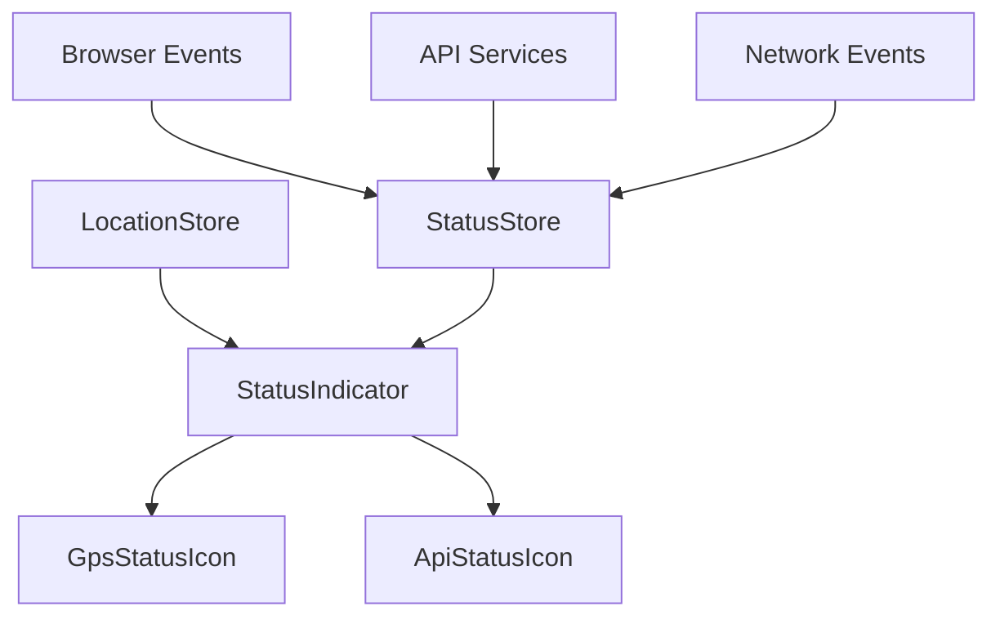

# Design Document: Status Indicator

## Overview

The Status Indicator is a header component that provides real-time visibility into system health by displaying GPS availability, location accuracy, and API connectivity status. It integrates with existing Zustand stores and follows the application's clean architecture patterns.

## Architecture

### Component Hierarchy
```
Header
├── StatusIndicator
    ├── GpsStatusIcon
    └── ApiStatusIcon
```

### State Management Integration
- **LocationStore**: Provides GPS status, accuracy, and permission states
- **New StatusStore**: Manages API connectivity and network status
- **Browser APIs**: Listens to online/offline events and geolocation changes

### Data Flow


## Components and Interfaces

### StatusIndicator Component
```typescript
import type { PermissionState, LocationAccuracy } from '../types/location';

interface StatusIndicatorProps {
  className?: string;
}

interface StatusState {
  gps: {
    status: 'available' | 'unavailable' | 'disabled';
    accuracy: LocationAccuracy | null; // Reuses 'high' | 'balanced' | 'low'
    permissionState: PermissionState | null;
    lastUpdated: number | null;
  };
  api: {
    status: 'online' | 'offline' | 'error';
    networkOnline: boolean;
    lastCheck: number | null;
    responseTime: number | null;
  };
}
```

### GPS Status Visual Design
```typescript
interface GpsVisualState {
  icon: 'GpsFixed' | 'GpsNotFixed' | 'GpsOff' | 'LocationDisabled';
  color: 'success' | 'warning' | 'error';
  tooltip: string;
}

// GPS Visual State Mapping
const GPS_VISUAL_STATES: Record<string, GpsVisualState> = {
  'available-high': {
    icon: 'GpsFixed',
    color: 'success',
    tooltip: 'GPS available with high accuracy'
  },
  'available-balanced': {
    icon: 'GpsFixed', 
    color: 'warning',
    tooltip: 'GPS available with balanced accuracy'
  },
  'available-low': {
    icon: 'GpsNotFixed',
    color: 'warning', 
    tooltip: 'GPS available with low accuracy'
  },
  'unavailable': {
    icon: 'GpsOff',
    color: 'error',
    tooltip: 'GPS signal unavailable'
  },
  'disabled': {
    icon: 'LocationDisabled',
    color: 'error',
    tooltip: 'Location services disabled'
  },
  'permission-denied': {
    icon: 'LocationDisabled',
    color: 'error',
    tooltip: 'Location permission denied'
  }
};
```

### API Status Visual Design
```typescript
interface ApiVisualState {
  icon: 'CloudDone' | 'WifiOff' | 'SignalWifiConnectedNoInternet4';
  color: 'success' | 'warning' | 'error';
  tooltip: string;
}

// API Visual State Mapping  
const API_VISUAL_STATES: Record<string, ApiVisualState> = {
  'online-fast': {
    icon: 'CloudDone',
    color: 'success',
    tooltip: 'API connected and responding quickly'
  },
  'online-slow': {
    icon: 'CloudDone',
    color: 'warning',
    tooltip: 'API connected but responding slowly'
  },
  'api-unreachable': {
    icon: 'CloudDone',
    color: 'error',
    tooltip: 'API service unavailable'
  },
  'network-offline': {
    icon: 'WifiOff',
    color: 'error',
    tooltip: 'No internet connection'
  },
  'network-limited': {
    icon: 'SignalWifiConnectedNoInternet4',
    color: 'error',
    tooltip: 'Connected to network but no internet access'
  }
};
```

### GpsStatusIcon Component
```typescript
import type { PermissionState, LocationAccuracy } from '../types/location';

interface GpsStatusIconProps {
  status: 'available' | 'unavailable' | 'disabled';
  accuracy: LocationAccuracy | null; // Reuses 'high' | 'balanced' | 'low'
  permissionState: PermissionState | null;
  lastUpdated: number | null;
  onClick?: () => void;
}
```

### ApiStatusIcon Component  
```typescript
interface ApiStatusIconProps {
  status: 'online' | 'offline' | 'error';
  networkOnline: boolean;
  lastCheck: number | null;
  responseTime: number | null;
  onClick?: () => void;
}
```

## Data Models

### GPS Status Model (Reusing Existing Location Types)
```typescript
import type { PermissionState, LocationAccuracy } from '../types/location';

type GpsStatus = 'available' | 'unavailable' | 'disabled';

interface GpsState {
  status: GpsStatus;
  accuracy: LocationAccuracy | null; // Reuses 'high' | 'balanced' | 'low'
  permissionState: PermissionState | null; // Reuses existing permission states
  lastUpdated: number | null;
}
```

### API Status Model
```typescript
type ApiStatus = 'online' | 'offline' | 'error';

interface ApiState {
  status: ApiStatus;
  networkOnline: boolean;
  lastCheck: number | null;
  responseTime: number | null;
  consecutiveFailures: number;
}
```

### Status Store Interface
```typescript
interface StatusStore {
  // API Status
  apiStatus: ApiStatus;
  networkOnline: boolean;
  lastApiCheck: number | null;
  responseTime: number | null;
  consecutiveFailures: number;
  
  // Actions
  checkApiHealth: () => Promise<void>;
  setNetworkStatus: (online: boolean) => void;
  startHealthMonitoring: () => void;
  stopHealthMonitoring: () => void;
}
```

## Correctness Properties

*A property is a characteristic or behavior that should hold true across all valid executions of a system-essentially, a formal statement about what the system should do. Properties serve as the bridge between human-readable specifications and machine-verifiable correctness guarantees.*

<function_calls>
<invoke name="prework">
<parameter name="featureName">status-indicator

### Property Reflection

After analyzing the acceptance criteria, I identified several properties that can be consolidated:

**Redundancy Analysis:**
- Properties 1.1, 1.2, 1.3 (GPS icon colors) can be combined into one comprehensive GPS visual state property
- Properties 2.1, 2.2, 2.3, 2.4 (API icon colors) can be combined into one comprehensive API visual state property  
- Properties 1.4, 2.5, 4.1, 4.2 (immediate updates) can be combined into one reactivity property
- Properties 1.5, 2.6, 5.1 (tooltip display) can be combined into one tooltip behavior property
- Properties 5.2, 5.3 (click interactions) can be combined into one click interaction property

**Final Properties:**
The following properties provide unique validation value without redundancy:

Property 1: GPS Visual State Mapping
*For any* GPS status (available/unavailable/disabled), accuracy level (high/balanced/low/null), and permission state, the GPS icon should display the correct icon and color combination: GpsFixed+green for available+high, GpsFixed+yellow for available+balanced, GpsNotFixed+yellow for available+low, GpsOff+red for unavailable, LocationDisabled+red for disabled/denied
**Validates: Requirements 1.1, 1.2, 1.3**

Property 2: API Visual State Mapping  
*For any* combination of API status, network status, and response time, the API icon should display the correct icon and color combination: CloudDone+green for fast responses, CloudDone+yellow for slow responses, CloudDone+red for API unreachable, WifiOff+red for network offline, SignalWifiConnectedNoInternet4+red for network without internet
**Validates: Requirements 2.1, 2.2, 2.3, 2.4**

Property 3: Status Update Reactivity
*For any* status change (GPS accuracy change, API connectivity change, network status change), the visual indicators should update within the specified time limits (2 seconds for GPS, 5 seconds for API)
**Validates: Requirements 1.4, 2.5, 4.1, 4.2**

Property 4: Tooltip Display Behavior
*For any* status icon in any state, hovering should display a descriptive tooltip with appropriate content for that status
**Validates: Requirements 1.5, 2.6, 5.1, 5.4**

Property 5: Click Interaction Behavior
*For any* status icon, clicking should display detailed information appropriate to that icon type (location details for GPS, connection details for API)
**Validates: Requirements 5.2, 5.3**

Property 6: Layout Integration
*For any* screen size, the status indicator should display both icons side by side in the header without interfering with existing functionality
**Validates: Requirements 3.2, 3.4, 3.5**

Property 7: Network Event Responsiveness
*For any* browser online/offline event, the API status should update immediately to reflect the network change
**Validates: Requirements 4.5**

Property 8: Smooth Transitions
*For any* rapid sequence of status changes, the visual transitions should occur without flickering or visual artifacts
**Validates: Requirements 4.6**

## Error Handling

### GPS Error Scenarios
- **Permission Denied**: Display red icon with "Location access denied" tooltip
- **Position Unavailable**: Display red icon with "GPS signal unavailable" tooltip  
- **Timeout**: Display yellow icon with "GPS signal weak" tooltip
- **Not Supported**: Display red icon with "Location services not supported" tooltip

### API Error Scenarios
- **Network Offline**: Display red icon with "No internet connection" tooltip
- **API Unreachable**: Display red icon with "Service temporarily unavailable" tooltip
- **Slow Response**: Display yellow icon with "Service responding slowly" tooltip
- **Authentication Error**: Display red icon with "API authentication failed" tooltip

### Graceful Degradation
- Icons gracefully degrade to basic states when detailed status unavailable
- Tooltips provide actionable guidance when possible
- Component continues functioning even if monitoring fails

## Testing Strategy

### Dual Testing Approach
The testing strategy combines unit tests for specific scenarios with property-based tests for comprehensive coverage:

**Unit Tests:**
- Specific GPS permission states and their visual representations
- Specific API error responses and their handling
- Browser online/offline event handling
- Component integration with existing header
- Mobile responsive behavior at specific breakpoints

**Property-Based Tests:**
- Universal icon and color combinations across all GPS status scenarios (Property 1)
- Universal icon and color combinations across all API/network status scenarios (Property 2)  
- Timing requirements across random status changes (Property 3)
- Tooltip behavior across all possible icon states (Property 4)
- Click interactions across all icon states (Property 5)
- Layout behavior across random screen sizes (Property 6)
- Network event responsiveness across random event sequences (Property 7)
- Visual transition smoothness across rapid state changes (Property 8)

**Property Test Configuration:**
- Minimum 100 iterations per property test
- Each test tagged with: **Feature: status-indicator, Property {number}: {property_text}**
- Use fast-check library for property-based testing in TypeScript
- Generate realistic GPS accuracy values, API response times, and network states

**Integration Testing:**
- Status indicator integration with existing header component
- Store integration testing with LocationStore and new StatusStore
- Browser API integration (geolocation, online/offline events)
- Cross-component interaction testing (header functionality preservation)