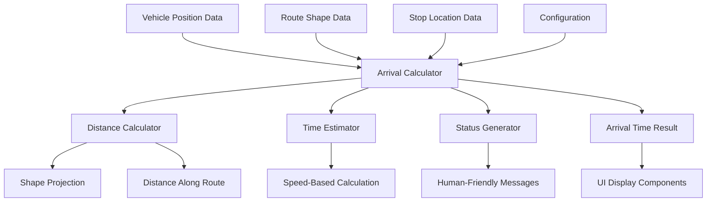

# Design Document: Vehicle Arrival Time

## Overview

The Vehicle Arrival Time feature provides real-time arrival estimates for multiple transit vehicles approaching target stops. The system calculates accurate time estimates by considering vehicle position, route geometry, trip sequences, and configurable speed parameters. It generates human-friendly status messages with proper sorting priority and supports both nearby view displays and specific stop queries.

The design prioritizes accuracy by using route shapes (polylines) over straight-line distances, while maintaining performance through efficient geometric calculations and configurable parameters. The system focuses on target stop calculations rather than vehicle next-stop logic, providing users with arrival times for stops they care about.

## Architecture

### High-Level Architecture



### Core Components

1. **Arrival Calculator**: Main orchestrator that coordinates distance calculation, time estimation, and status generation for target stops
2. **Distance Calculator**: Handles geometric calculations along route shapes and fallback distance calculations
3. **Time Estimator**: Converts distances to time estimates using configurable speed parameters and dwell time
4. **Status Generator**: Creates human-friendly arrival messages based on target stop relationship and proximity
5. **Trip Sequence Analyzer**: Determines if target stop is upcoming, passed, or not in vehicle's trip
6. **Off-Route Detector**: Identifies vehicles that are off-route based on route_id and distance thresholds
7. **Vehicle Sorter**: Sorts vehicles by arrival priority (at stop → in minutes → departed → off route)

## Target Stop Logic

### Trip Sequence Analysis

The system analyzes each vehicle's trip to determine the relationship with the target stop:

```typescript
interface TripSequenceAnalysis {
  targetStopFound: boolean;
  targetStopSequence?: number;
  vehicleProgressMethod: 'gps_proximity' | 'estimated_position' | 'unknown';
  relation: 'upcoming' | 'passed' | 'not_in_trip';
}
```

### Vehicle Position Inference

Since vehicles don't report their current sequence position directly, the system uses route shape projection to accurately determine progress:

1. **Route Shape Projection**: Project vehicle GPS position onto the trip's route shape to find the closest point
2. **Segment Identification**: Determine which two consecutive stops the vehicle is between based on shape projections
3. **Next Stop Determination**: Identify the next stop in sequence based on the segment the vehicle is within

```typescript
interface VehicleProgressEstimation {
  projectionPoint: GpsPosition;
  segmentBetweenStops: {
    previousStop: TripStop | null; // null when before first stop
    nextStop: TripStop;
  } | null; // null when after last stop or off-route
  confidence: 'high' | 'medium' | 'low';
  method: 'route_projection' | 'stop_segments' | 'off_route' | 'fallback';
}
```

### Segment-Based Position Logic

```typescript
function estimateVehicleProgressWithShape(
  vehicle: Vehicle,
  tripStops: TripStop[],
  routeShape: RouteShape
): VehicleProgressEstimation {
  // [Previous implementation using route shape projection]
  // ... existing code ...
}

function estimateVehicleProgressWithStops(
  vehicle: Vehicle,
  tripStops: TripStop[]
): VehicleProgressEstimation {
  
  // 1. Sort stops by sequence
  const sortedStops = [...tripStops].sort((a, b) => a.sequence - b.sequence);
  
  if (sortedStops.length < 2) {
    // Not enough stops to determine segments
    return {
      projectionPoint: vehicle.position,
      segmentBetweenStops: null,
      confidence: 'low',
      method: 'stop_segments'
    };
  }
  
  // 2. Find the segment with minimum sum of distances to both endpoints
  let bestSegment: { previousStop: TripStop; nextStop: TripStop; totalDistance: number } | null = null;
  
  for (let i = 0; i < sortedStops.length - 1; i++) {
    const stopA = sortedStops[i];
    const stopB = sortedStops[i + 1];
    
    const distanceToA = calculateDistance(vehicle.position, stopA.position);
    const distanceToB = calculateDistance(vehicle.position, stopB.position);
    const totalDistance = distanceToA + distanceToB;
    
    if (!bestSegment || totalDistance < bestSegment.totalDistance) {
      bestSegment = {
        previousStop: stopA,
        nextStop: stopB,
        totalDistance
      };
    }
  }
  
  if (bestSegment) {
    // 3. Verify the vehicle is reasonably close to the segment
    const segmentLength = calculateDistance(
      bestSegment.previousStop.position, 
      bestSegment.nextStop.position
    );
    
    // If sum of distances is much larger than segment length, vehicle might be off-route
    const tolerance = 0.5; // 50% tolerance
    const isReasonablyClose = bestSegment.totalDistance <= segmentLength * (1 + tolerance);
    
    return {
      projectionPoint: vehicle.position,
      segmentBetweenStops: {
        previousStop: bestSegment.previousStop,
        nextStop: bestSegment.nextStop
      },
      confidence: isReasonablyClose ? 'medium' : 'low',
      method: 'stop_segments'
    };
  }
  
  // 4. No clear segment identified - vehicle position is unclear
  // This happens when vehicle is likely off-route or GPS data is unreliable
  return {
    projectionPoint: vehicle.position,
    segmentBetweenStops: null,
    confidence: 'low',
    method: 'stop_segments'
  };
}
```

### Target Stop Relationship Logic

```typescript
function determineTargetStopRelation(
  vehicle: Vehicle,
  targetStop: Stop,
  tripStops: TripStop[],
  routeShape?: RouteShape
): 'upcoming' | 'passed' | 'not_in_trip' {
  
  // 1. Find target stop in trip sequence
  const targetStopInTrip = tripStops.find(ts => ts.stopId === targetStop.id);
  if (!targetStopInTrip) return 'not_in_trip';
  
  // 2. Estimate vehicle's current position using available method
  let vehicleProgress: VehicleProgressEstimation;
  
  if (routeShape) {
    // Use route shape projection (most accurate)
    vehicleProgress = estimateVehicleProgressWithShape(vehicle, tripStops, routeShape);
  } else {
    // Fallback: use stop-to-stop GPS segments
    vehicleProgress = estimateVehicleProgressWithStops(vehicle, tripStops);
  }
  
  // 3. Compare target stop with vehicle's segment
  if (vehicleProgress.segmentBetweenStops) {
    // Vehicle is between two stops - compare sequences
    const nextStopSequence = vehicleProgress.segmentBetweenStops.nextStop.sequence;
    const targetSequence = targetStopInTrip.sequence;
    
    return targetSequence >= nextStopSequence ? 'upcoming' : 'passed';
  }
  
  // 4. Low confidence or no segment identified - assume upcoming
  return 'upcoming';
}

function estimateVehicleProgressWithShape(
  vehicle: Vehicle,
  tripStops: TripStop[],
  routeShape: RouteShape
): VehicleProgressEstimation {
```

### Key Advantages of This Approach

1. **Shape-Aware**: Uses actual route geometry instead of straight-line distances
2. **Directional**: Accounts for vehicle direction along the route shape
3. **Segment-Based**: Identifies which stops the vehicle is between, not just closest
4. **Sequence-Aware**: Uses trip sequence numbers for accurate upcoming/passed determination
5. **Handles Curves**: Works correctly even when routes have bends or curves

### Off-Route Detection

Vehicles are classified as "off-route" when:
1. **No Route ID**: Vehicle has null or undefined `route_id`
2. **Distance Threshold**: Vehicle's projected distance from route shape exceeds `offRouteThreshold`

### Status Priority System

The system uses a clear priority hierarchy for vehicle sorting:
1. **At Stop** (priority 0): Within proximity threshold AND speed = 0
2. **In Minutes** (priority 1): Target stop upcoming, sorted by estimated minutes ascending
3. **Departed** (priority 2): Target stop already passed in trip sequence
4. **Off Route** (priority 3): No route_id or exceeds distance threshold

## Components and Interfaces

### ArrivalCalculator Interface

```typescript
interface ArrivalCalculator {
  calculateArrivalTime(
    vehicle: Vehicle,
    targetStop: Stop,
    routeShape?: RouteShape
  ): ArrivalTimeResult;
  
  calculateMultipleArrivals(
    vehicles: Vehicle[],
    targetStop: Stop
  ): ArrivalTimeResult[];
  
  sortVehiclesByArrival(results: ArrivalTimeResult[]): ArrivalTimeResult[];
  
  determineTargetStopRelation(
    vehicle: Vehicle,
    targetStop: Stop
  ): 'upcoming' | 'passed' | 'not_in_trip';
  
  isVehicleOffRoute(
    vehicle: Vehicle,
    routeShape?: RouteShape
  ): boolean;
}

interface ArrivalTimeResult {
  vehicleId: number;
  estimatedMinutes: number;
  status: ArrivalStatus;
  statusMessage: string;
  confidence: 'high' | 'medium' | 'low';
  calculationMethod: 'route_shape' | 'stop_segments';
}

type ArrivalStatus = 'at_stop' | 'in_minutes' | 'departed' | 'off_route';
```

### DistanceCalculator Interface

```typescript
interface DistanceCalculator {
  calculateDistanceAlongShape(
    vehiclePosition: GpsPosition,
    targetStop: Stop,
    routeShape: RouteShape
  ): DistanceResult;
  
  calculateDistanceViaStops(
    vehiclePosition: GpsPosition,
    targetStop: Stop,
    intermediateStops: Stop[]
  ): DistanceResult;
  
  projectPointToShape(
    point: GpsPosition,
    shape: RouteShape
  ): ProjectionResult;
}

interface DistanceResult {
  totalDistance: number;
  method: 'route_shape' | 'stop_segments';
  confidence: 'high' | 'medium' | 'low';
}
```

### Configuration Constants

```typescript
// Developer-configurable constants (not user-facing)
const ARRIVAL_CONSTANTS = {
  AVERAGE_SPEED: 25, // km/h - typical bus speed for time calculations
  DWELL_TIME: 30, // seconds per intermediate stop
  PROXIMITY_THRESHOLD: 50, // meters for "at stop" status
  OFF_ROUTE_THRESHOLD: 200, // meters for "off route" classification
} as const;
```

## Data Models

### Core Data Types

```typescript
interface Vehicle {
  id: string;
  position: GpsPosition;
  speed?: number; // km/h from API if available
  trip: Trip;
  lastUpdated: Date;
}

interface Trip {
  id: string;
  routeId: string;
  stops: TripStop[];
  shape?: RouteShape;
}

interface TripStop {
  stopId: string;
  sequence: number;
  scheduledTime?: Date;
  position: GpsPosition;
}

interface Stop {
  id: string;
  name: string;
  position: GpsPosition;
}

interface RouteShape {
  id: string;
  points: GpsPosition[];
  segments: ShapeSegment[];
}

interface ShapeSegment {
  start: GpsPosition;
  end: GpsPosition;
  distance: number;
}

interface GpsPosition {
  latitude: number;
  longitude: number;
}
```

### Calculation Results

```typescript
interface ProjectionResult {
  closestPoint: GpsPosition;
  distanceToShape: number;
  segmentIndex: number;
  positionAlongSegment: number; // 0-1
}

interface ArrivalTimeResult {
  vehicleId: number;
  estimatedMinutes: number;
  status: ArrivalStatus;
  statusMessage: string;
  confidence: 'high' | 'medium' | 'low';
  calculationMethod: 'route_shape' | 'stop_segments';
  rawDistance?: number;
  debugInfo?: {
    vehicleToShapeDistance: number;
    distanceAlongShape: number;
    stopToShapeDistance: number;
    totalCalculatedDistance: number;
    targetStopRelation: 'upcoming' | 'passed' | 'not_in_trip';
  };
}

type ArrivalStatus = 'at_stop' | 'in_minutes' | 'departed' | 'off_route';

// Sort order: lower number = higher priority
const ARRIVAL_STATUS_SORT_ORDER: Record<ArrivalStatus, number> = {
  'at_stop': 0,
  'in_minutes': 1,
  'departed': 2,
  'off_route': 3
};
## Correctness Properties

*A property is a characteristic or behavior that should hold true across all valid executions of a system—essentially, a formal statement about what the system should do. Properties serve as the bridge between human-readable specifications and machine-verifiable correctness guarantees.*