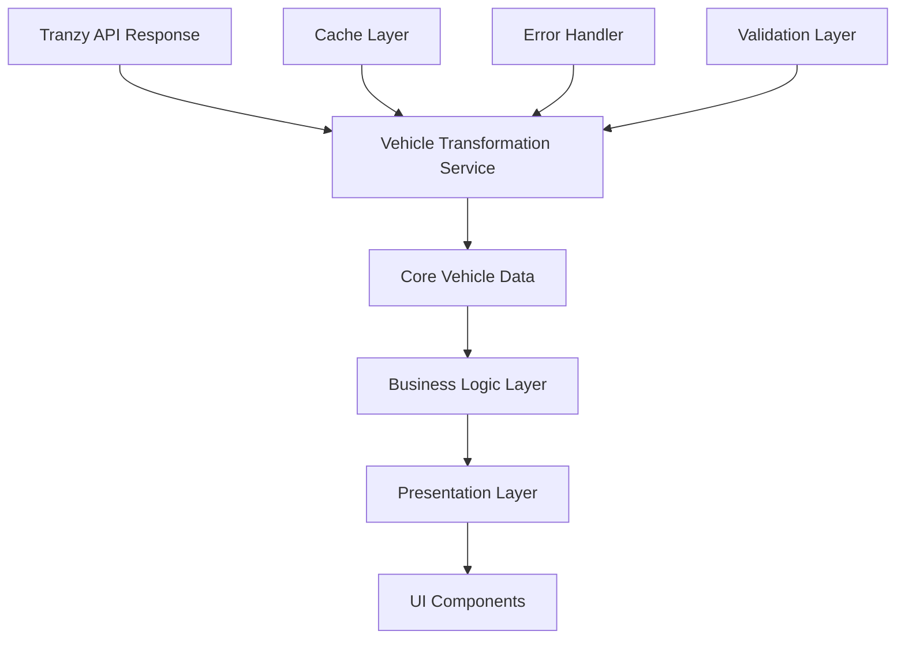

# Design Document

## Overview

This design establishes a clean, modern vehicle data architecture that eliminates the current type system fragmentation, reduces code duplication, and implements proper separation of concerns. The new architecture will replace the existing dual type system with a unified approach based on composition and single responsibility principles.

## Architecture

### Core Principles

1. **Single Source of Truth**: One canonical vehicle type serves as the foundation
2. **Composition over Inheritance**: Complex types built through composition of simpler types
3. **Separation of Concerns**: Data, business logic, and presentation layers are distinct
4. **Linear Data Flow**: Unidirectional transformation pipeline from API to UI
5. **Reference-Based Relationships**: Use IDs instead of nested objects to prevent circular dependencies

### High-Level Architecture



## Components and Interfaces

### Core Data Layer

#### CoreVehicle Interface
```typescript
interface CoreVehicle {
  id: string;
  routeId: string;
  tripId?: string;
  label: string;
  position: Coordinates;
  timestamp: Date;
  speed?: number;
  bearing?: number;
  isWheelchairAccessible: boolean;
  isBikeAccessible: boolean;
}
```

#### Coordinates Interface
```typescript
interface Coordinates {
  latitude: number;
  longitude: number;
  accuracy?: number;
}
```

### Business Logic Layer

#### VehicleSchedule Interface
```typescript
interface VehicleSchedule {
  vehicleId: string;
  stationId: string;
  estimatedArrival: Date;
  scheduledArrival?: Date;
  minutesAway: number;
  delay?: number;
  confidence: ConfidenceLevel;
}
```

#### VehicleDirection Interface
```typescript
interface VehicleDirection {
  vehicleId: string;
  status: DirectionStatus;
  userContext: 'work' | 'home' | 'unknown';
  stopSequence?: StopSequenceItem[];
}
```

#### Route Information Interface
```typescript
interface RouteInfo {
  id: string;
  shortName: string;
  longName: string;
  description: string;
  type: RouteType;
  color?: string;
  textColor?: string;
}
```

### Presentation Layer

#### VehicleDisplayData Interface
```typescript
interface VehicleDisplayData {
  vehicleId: string;
  displayName: string;
  destination: string;
  arrivalText: string;
  statusColor: string;
  confidenceIndicator: string;
  isRealTime: boolean;
}
```

### Transformation Service

#### VehicleTransformationService Class
```typescript
class VehicleTransformationService {
  private pipeline: TransformationPipeline;
  private cache: TransformationCache;
  private validator: DataValidator;
  
  transform(
    rawData: TranzyVehicleResponse[],
    context: TransformationContext
  ): TransformedVehicleData;
  
  private normalizeApiData(raw: TranzyVehicleResponse[]): CoreVehicle[];
  private enrichWithSchedule(vehicles: CoreVehicle[], context: TransformationContext): VehicleSchedule[];
  private analyzeDirections(vehicles: CoreVehicle[], context: TransformationContext): VehicleDirection[];
  private generateDisplayData(vehicles: CoreVehicle[], schedules: VehicleSchedule[]): VehicleDisplayData[];
}
```

#### Transformation Pipeline
```typescript
interface TransformationStep<TInput, TOutput> {
  name: string;
  transform(input: TInput, context: TransformationContext): TOutput;
  validate?(input: TInput): ValidationResult;
}

class TransformationPipeline {
  private steps: TransformationStep<any, any>[];
  
  addStep<TInput, TOutput>(step: TransformationStep<TInput, TOutput>): this;
  execute<TInput, TOutput>(input: TInput, context: TransformationContext): TOutput;
}
```

## Data Models

### Transformation Context
```typescript
interface TransformationContext {
  userLocation?: Coordinates;
  favoriteRoutes: string[];
  targetStations: Station[];
  preferences: UserPreferences;
  timestamp: Date;
}
```

### Transformed Vehicle Data
```typescript
interface TransformedVehicleData {
  vehicles: CoreVehicle[];
  schedules: Map<string, VehicleSchedule>;
  directions: Map<string, VehicleDirection>;
  displayData: Map<string, VehicleDisplayData>;
  routeInfo: Map<string, RouteInfo>;
  metadata: TransformationMetadata;
}
```

### Error Handling
```typescript
interface TransformationError extends Error {
  step: string;
  vehicleId?: string;
  recoverable: boolean;
  context: Record<string, any>;
}

interface ValidationResult {
  isValid: boolean;
  errors: ValidationError[];
  warnings: ValidationWarning[];
}
```

## Correctness Properties

*A property is a characteristic or behavior that should hold true across all valid executions of a system-essentially, a formal statement about what the system should do. Properties serve as the bridge between human-readable specifications and machine-verifiable correctness guarantees.*

### Property Reflection

After analyzing all acceptance criteria, I identified several areas where properties can be consolidated:

- **Type System Properties (1.1-1.5)**: Can be combined into comprehensive type system validation
- **Transformation Properties (2.1-2.5)**: Can be unified into transformation pipeline validation  
- **Separation Properties (3.1-3.5)**: Can be consolidated into architectural boundary validation
- **Performance Properties (4.1-4.3, 4.5)**: Can be combined into performance characteristic validation
- **Error Handling Properties (5.1-5.5)**: Can be unified into error resilience validation
- **Developer Experience Properties (6.1-6.5)**: Can be consolidated into API usability validation
- **Testing Properties (7.1-7.3, 7.5)**: Can be combined into test coverage validation
- **Data Consistency Properties (8.1-8.5)**: Can be unified into data integrity validation

### Core Properties

**Property 1: Type System Integrity**
*For any* vehicle data structure in the codebase, there should be exactly one canonical definition, and all complex types should be composed from simpler types without circular dependencies.
**Validates: Requirements 1.1, 1.2, 1.3, 1.4, 1.5**

**Property 2: Transformation Pipeline Consistency**
*For any* raw API data, processing through the transformation service should produce consistent results, and all transformations should flow through the single pipeline without duplication.
**Validates: Requirements 2.1, 2.2, 2.3, 2.4, 2.5**

**Property 3: Architectural Separation**
*For any* change to one layer (data, business, presentation), the other layers should remain unaffected, ensuring proper separation of concerns.
**Validates: Requirements 3.1, 3.2, 3.3, 3.4, 3.5**

**Property 4: Performance Characteristics**
*For any* vehicle dataset, transformations should minimize data copying, use efficient lookups, implement caching, and support lazy evaluation.
**Validates: Requirements 4.1, 4.2, 4.3, 4.5**

**Property 5: Error Resilience**
*For any* malformed input or transformation failure, the system should provide fallback values, continue processing with partial data, validate inputs, and provide descriptive error messages.
**Validates: Requirements 5.1, 5.2, 5.3, 5.4, 5.5**

**Property 6: Developer API Usability**
*For any* public interface, there should be comprehensive TypeScript types, JSDoc documentation, factory functions for testing, type-safe access patterns, and clear documentation.
**Validates: Requirements 6.1, 6.2, 6.3, 6.4, 6.5**

**Property 7: Test Coverage Completeness**
*For any* transformation function or pipeline step, there should be corresponding property-based tests, unit tests, integration tests, and performance benchmarks.
**Validates: Requirements 7.1, 7.2, 7.3, 7.5**

**Property 8: Data Integrity Consistency**
*For any* vehicle data update, all components should receive consistent formats, changes should propagate to consumers, referential integrity should be maintained, stale data should be prevented, and sync failures should provide user feedback.
**Validates: Requirements 8.1, 8.2, 8.3, 8.4, 8.5**

## Error Handling

### Validation Strategy
- **Input Validation**: Validate all API responses before processing
- **Type Guards**: Use TypeScript type guards for runtime type checking
- **Schema Validation**: Implement JSON schema validation for API responses
- **Graceful Degradation**: Provide fallback values for missing or invalid data

### Error Recovery
- **Partial Processing**: Continue processing valid vehicles when some fail
- **Retry Logic**: Implement exponential backoff for transient failures
- **Circuit Breaker**: Prevent cascade failures in transformation pipeline
- **Error Boundaries**: Isolate errors to prevent system-wide failures

### Error Reporting
```typescript
interface ErrorReporter {
  reportTransformationError(error: TransformationError): void;
  reportValidationError(error: ValidationError): void;
  reportPerformanceIssue(metric: PerformanceMetric): void;
}
```

## Testing Strategy

### Dual Testing Approach
The system will use both unit tests and property-based tests for comprehensive coverage:

- **Unit tests**: Verify specific examples, edge cases, and error conditions
- **Property tests**: Verify universal properties across all inputs
- Both are complementary and necessary for comprehensive coverage

### Property-Based Testing Configuration
- **Library**: fast-check for TypeScript property-based testing
- **Iterations**: Minimum 100 iterations per property test
- **Test Tags**: Each property test references its design document property
- **Tag Format**: **Feature: vehicle-data-architecture-refactoring, Property {number}: {property_text}**

### Unit Testing Focus
- Specific examples demonstrating correct behavior
- Integration points between transformation steps
- Edge cases and error conditions
- Performance benchmarks for critical paths

### Property Testing Focus
- Universal properties holding for all inputs
- Comprehensive input coverage through randomization
- Invariant preservation across transformations
- Round-trip properties for serialization/deserialization

### Test Data Generation
```typescript
interface VehicleDataGenerator {
  generateCoreVehicle(): CoreVehicle;
  generateApiResponse(): TranzyVehicleResponse;
  generateTransformationContext(): TransformationContext;
  generateMalformedData(): Partial<TranzyVehicleResponse>;
}
```