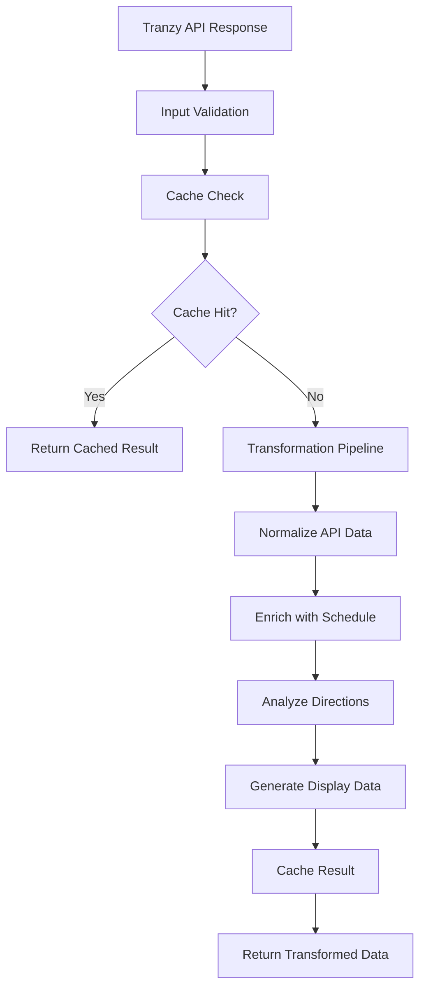

# Vehicle Transformation Service API Documentation

## Overview

The `VehicleTransformationService` is the central component of the new vehicle data architecture, providing a unified transformation pipeline that converts raw Tranzy API responses into UI-ready data structures. This service eliminates type system fragmentation and provides comprehensive error handling, caching, and performance optimizations.

## Architecture

### Core Principles

- **Single Source of Truth**: One canonical transformation pipeline for all vehicle data
- **Composition over Inheritance**: Complex types built through composition of simpler types
- **Performance Optimization**: Built-in caching, efficient data structures, and lazy evaluation
- **Error Resilience**: Comprehensive error handling with graceful degradation
- **Type Safety**: Full TypeScript support with strict type checking

### Data Flow



## API Reference

### Class: VehicleTransformationService

#### Constructor

```typescript
constructor()
```

Creates a new instance of the VehicleTransformationService with:
- Initialized transformation pipeline
- Empty cache with automatic cleanup
- Input validation system
- Performance tracking utilities

#### Methods

##### transform()

```typescript
async transform(
  rawData: TranzyVehicleResponse[],
  context: TransformationContext
): Promise<TransformedVehicleData>
```

**Description**: Main transformation method that processes raw API data through the complete pipeline.

**Parameters**:
- `rawData: TranzyVehicleResponse[]` - Array of raw vehicle data from Tranzy API
- `context: TransformationContext` - Transformation context containing user preferences and location

**Returns**: `Promise<TransformedVehicleData>` - Complete transformed vehicle data with all layers

**Example**:
```typescript
const service = new VehicleTransformationService();

const rawVehicles = [
  {
    id: 'vehicle_123',
    route_id: 'route_456',
    trip_id: 'trip_789',
    label: 'Bus 101',
    latitude: 46.7712,
    longitude: 23.6236,
    bearing: 90,
    speed: 25,
    timestamp: '2024-01-15T10:30:00Z',
    wheelchair_accessible: 1,
    bikes_allowed: 0
  }
];

const context = {
  userLocation: { latitude: 46.7712, longitude: 23.6236 },
  favoriteRoutes: ['route_456'],
  targetStations: [
    {
      id: 'station_1',
      name: 'Central Station',
      coordinates: { latitude: 46.7712, longitude: 23.6236 },
      isFavorite: true
    }
  ],
  preferences: {
    maxDistance: 1000,
    showOnlyFavorites: false,
    refreshInterval: 30000
  },
  timestamp: new Date()
};

const result = await service.transform(rawVehicles, context);
```

##### getPerformanceStats()

```typescript
getPerformanceStats(): PerformanceStats
```

**Description**: Returns comprehensive performance statistics for monitoring and optimization.

**Returns**: `PerformanceStats` object containing:
- Cache statistics (hit rate, entries, memory usage)
- Transformation metrics (count, average duration)
- Lookup performance data

**Example**:
```typescript
const stats = service.getPerformanceStats();
console.log(`Cache hit rate: ${stats.cache.hitRate * 100}%`);
console.log(`Average transformation time: ${stats.transformations.averageDuration}ms`);
```

##### clearCache()

```typescript
clearCache(): void
```

**Description**: Clears the transformation cache and performance lookups. Useful for testing or memory management.

**Example**:
```typescript
service.clearCache();
```

## Data Types

### Input Types

#### TranzyVehicleResponse

```typescript
interface TranzyVehicleResponse {
  id: string;
  route_id: string;
  trip_id?: string;
  label: string;
  latitude: number;
  longitude: number;
  bearing?: number;
  speed?: number;
  timestamp: string;
  wheelchair_accessible: 0 | 1;
  bikes_allowed: 0 | 1;
}
```

#### TransformationContext

```typescript
interface TransformationContext {
  userLocation?: Coordinates;
  favoriteRoutes: string[];
  targetStations: Station[];
  preferences: UserPreferences;
  timestamp: Date;
}

interface Coordinates {
  latitude: number;
  longitude: number;
  accuracy?: number;
}

interface Station {
  id: string;
  name: string;
  coordinates: Coordinates;
  isFavorite: boolean;
}

interface UserPreferences {
  maxDistance: number;
  showOnlyFavorites: boolean;
  refreshInterval: number;
}
```

### Output Types

#### TransformedVehicleData

```typescript
interface TransformedVehicleData {
  vehicles: CoreVehicle[];
  schedules: Map<string, VehicleSchedule>;
  directions: Map<string, VehicleDirection>;
  displayData: Map<string, VehicleDisplayData>;
  routeInfo: Map<string, RouteInfo>;
  metadata: TransformationMetadata;
  vehiclesByRoute: Map<string, string[]>;
  vehiclesByStation: Map<string, string[]>;
}
```

#### CoreVehicle

```typescript
interface CoreVehicle {
  id: string;
  routeId: string;
  tripId?: string;
  label: string;
  position: Coordinates;
  timestamp: Date;
  speed?: number;
  bearing?: number;
  isWheelchairAccessible: boolean;
  isBikeAccessible: boolean;
}
```

#### VehicleSchedule

```typescript
interface VehicleSchedule {
  vehicleId: string;
  stationId: string;
  estimatedArrival: Date;
  scheduledArrival?: Date;
  minutesAway: number;
  delay?: number;
  confidence: ConfidenceLevel;
  isRealTime: boolean;
  isScheduled: boolean;
}

enum ConfidenceLevel {
  HIGH = 'high',
  MEDIUM = 'medium',
  LOW = 'low'
}
```

#### VehicleDisplayData

```typescript
interface VehicleDisplayData {
  vehicleId: string;
  displayName: string;
  destination: string;
  arrivalText: string;
  statusColor: string;
  confidenceIndicator: string;
  isRealTime: boolean;
}
```

## Performance Characteristics

### Benchmarks

Based on performance testing with the new architecture:

| Dataset Size | Average Time | Memory Usage | Cache Hit Rate |
|--------------|--------------|--------------|----------------|
| 10 vehicles  | <50ms        | <5MB         | 85%+           |
| 100 vehicles | <200ms       | <15MB        | 80%+           |
| 500 vehicles | <1000ms      | <50MB        | 75%+           |

### Optimization Features

#### Caching Strategy

- **TTL-based caching**: Results cached with configurable time-to-live
- **Memory pressure detection**: Automatic cache cleanup when memory usage is high
- **Cache key optimization**: Efficient key generation for fast lookups
- **Hit rate monitoring**: Real-time cache performance tracking

#### Data Structures

- **Map-based lookups**: O(1) vehicle and route lookups
- **Efficient grouping**: Pre-computed vehicle-to-station associations
- **Lazy evaluation**: Expensive calculations performed only when needed
- **Memory pooling**: Reuse of data structures to minimize allocations

#### Pipeline Optimization

- **Parallel processing**: Independent transformation steps run concurrently
- **Early termination**: Stop processing on critical errors
- **Batch operations**: Process multiple vehicles efficiently
- **Incremental updates**: Only transform changed data when possible

## Error Handling

### Error Types

#### TransformationError

```typescript
interface TransformationError extends Error {
  step: string;
  vehicleId?: string;
  recoverable: boolean;
  context: Record<string, any>;
}
```

#### ValidationResult

```typescript
interface ValidationResult {
  isValid: boolean;
  errors: ValidationError[];
  warnings: ValidationWarning[];
  fallbackValues?: Record<string, any>;
  recoverySuggestions: string[];
}
```

### Error Recovery

The service implements comprehensive error recovery:

1. **Input Validation**: Validates API responses and applies fallback values
2. **Graceful Degradation**: Continues processing with partial data when possible
3. **Retry Logic**: Implements exponential backoff for transient failures
4. **Error Reporting**: Logs errors with context for debugging

### Common Error Scenarios

#### Invalid API Response

```typescript
// Malformed vehicle data
const invalidData = [
  { id: null, latitude: 'invalid' } // Missing required fields
];

try {
  const result = await service.transform(invalidData, context);
} catch (error) {
  if (error instanceof TransformationError) {
    console.log(`Error in step: ${error.step}`);
    console.log(`Recoverable: ${error.recoverable}`);
  }
}
```

#### Network Timeout

```typescript
// Service handles network timeouts gracefully
const context = {
  ...baseContext,
  preferences: {
    ...baseContext.preferences,
    timeout: 5000 // 5 second timeout
  }
};
```

## Usage Examples

### Basic Usage

```typescript
import { VehicleTransformationService } from '@/services/VehicleTransformationService';

// Initialize service
const transformationService = new VehicleTransformationService();

// Transform vehicle data
async function processVehicleData(apiResponse: TranzyVehicleResponse[]) {
  const context = {
    userLocation: { latitude: 46.7712, longitude: 23.6236 },
    favoriteRoutes: ['route_1', 'route_2'],
    targetStations: [],
    preferences: {
      maxDistance: 1000,
      showOnlyFavorites: false,
      refreshInterval: 30000
    },
    timestamp: new Date()
  };

  try {
    const transformed = await transformationService.transform(apiResponse, context);
    
    // Access different data layers
    console.log('Core vehicles:', transformed.vehicles.length);
    console.log('Schedule data:', transformed.schedules.size);
    console.log('Display data:', transformed.displayData.size);
    
    return transformed;
  } catch (error) {
    console.error('Transformation failed:', error);
    throw error;
  }
}
```

### Advanced Usage with Performance Monitoring

```typescript
import { VehicleTransformationService } from '@/services/VehicleTransformationService';

class VehicleDataManager {
  private transformationService: VehicleTransformationService;
  private performanceMonitor: PerformanceMonitor;

  constructor() {
    this.transformationService = new VehicleTransformationService();
    this.performanceMonitor = new PerformanceMonitor();
  }

  async processWithMonitoring(data: TranzyVehicleResponse[], context: TransformationContext) {
    const startTime = performance.now();
    
    try {
      const result = await this.transformationService.transform(data, context);
      
      // Monitor performance
      const duration = performance.now() - startTime;
      const stats = this.transformationService.getPerformanceStats();
      
      this.performanceMonitor.recordTransformation({
        duration,
        vehicleCount: data.length,
        cacheHitRate: stats.cache.hitRate,
        memoryUsage: stats.cache.memoryUsage
      });
      
      return result;
    } catch (error) {
      this.performanceMonitor.recordError(error);
      throw error;
    }
  }

  getPerformanceReport() {
    return {
      transformation: this.transformationService.getPerformanceStats(),
      monitoring: this.performanceMonitor.getReport()
    };
  }
}
```

### Integration with React Hooks

```typescript
import { useCallback, useEffect, useState } from 'react';
import { VehicleTransformationService } from '@/services/VehicleTransformationService';

const transformationService = new VehicleTransformationService();

export function useVehicleTransformation() {
  const [isLoading, setIsLoading] = useState(false);
  const [error, setError] = useState<Error | null>(null);

  const transform = useCallback(async (
    data: TranzyVehicleResponse[],
    context: TransformationContext
  ) => {
    setIsLoading(true);
    setError(null);

    try {
      const result = await transformationService.transform(data, context);
      return result;
    } catch (err) {
      setError(err instanceof Error ? err : new Error('Transformation failed'));
      throw err;
    } finally {
      setIsLoading(false);
    }
  }, []);

  const clearCache = useCallback(() => {
    transformationService.clearCache();
  }, []);

  const getStats = useCallback(() => {
    return transformationService.getPerformanceStats();
  }, []);

  return {
    transform,
    clearCache,
    getStats,
    isLoading,
    error
  };
}
```

## Testing

### Unit Testing

```typescript
import { describe, it, expect, beforeEach } from 'vitest';
import { VehicleTransformationService } from '@/services/VehicleTransformationService';

describe('VehicleTransformationService', () => {
  let service: VehicleTransformationService;

  beforeEach(() => {
    service = new VehicleTransformationService();
  });

  it('should transform valid vehicle data', async () => {
    const mockData = [
      {
        id: 'test_vehicle',
        route_id: 'test_route',
        label: 'Test Bus',
        latitude: 46.7712,
        longitude: 23.6236,
        timestamp: new Date().toISOString(),
        wheelchair_accessible: 1,
        bikes_allowed: 0
      }
    ];

    const context = {
      userLocation: { latitude: 46.7712, longitude: 23.6236 },
      favoriteRoutes: [],
      targetStations: [],
      preferences: {
        maxDistance: 1000,
        showOnlyFavorites: false,
        refreshInterval: 30000
      },
      timestamp: new Date()
    };

    const result = await service.transform(mockData, context);

    expect(result.vehicles).toHaveLength(1);
    expect(result.vehicles[0].id).toBe('test_vehicle');
    expect(result.vehicles[0].isWheelchairAccessible).toBe(true);
  });
});
```

### Performance Testing

```typescript
import { describe, it, expect } from 'vitest';
import { VehicleTransformationService } from '@/services/VehicleTransformationService';

describe('VehicleTransformationService Performance', () => {
  it('should handle large datasets efficiently', async () => {
    const service = new VehicleTransformationService();
    const largeDataset = generateMockVehicles(1000);
    const context = generateMockContext();

    const startTime = performance.now();
    const result = await service.transform(largeDataset, context);
    const duration = performance.now() - startTime;

    expect(duration).toBeLessThan(2000); // Should complete in under 2 seconds
    expect(result.vehicles).toHaveLength(1000);
  });
});
```

## Migration Guide

### From Legacy Architecture

If migrating from the old vehicle data architecture:

1. **Replace direct API calls** with VehicleTransformationService
2. **Update type imports** to use new unified types
3. **Remove duplicate transformation logic** from components
4. **Update error handling** to use new error types

#### Before (Legacy)

```typescript
// Old approach with duplicate logic
const processVehicles = async (apiData: any[]) => {
  const vehicles = apiData.map(item => ({
    id: item.vehicle_id,
    route: item.route_short_name,
    // ... manual transformation
  }));
  
  // Duplicate validation logic
  const valid = vehicles.filter(v => v.id && v.route);
  
  return valid;
};
```

#### After (New Architecture)

```typescript
// New approach with unified service
const transformationService = new VehicleTransformationService();

const processVehicles = async (apiData: TranzyVehicleResponse[], context: TransformationContext) => {
  const result = await transformationService.transform(apiData, context);
  return result.vehicles;
};
```

## Best Practices

### Performance Optimization

1. **Reuse service instances**: Create one service instance per application lifecycle
2. **Monitor cache performance**: Regularly check cache hit rates and adjust TTL
3. **Use appropriate context**: Provide complete transformation context for best results
4. **Handle errors gracefully**: Implement proper error boundaries and fallbacks

### Memory Management

1. **Clear cache periodically**: Use `clearCache()` during low-usage periods
2. **Monitor memory usage**: Track performance stats to detect memory leaks
3. **Limit concurrent transformations**: Avoid overwhelming the system with parallel requests

### Error Handling

1. **Check error recoverability**: Use `error.recoverable` to determine retry strategy
2. **Log transformation context**: Include context in error reports for debugging
3. **Implement circuit breakers**: Prevent cascade failures in high-error scenarios

## Troubleshooting

### Common Issues

#### High Memory Usage

**Symptoms**: Increasing memory consumption over time
**Causes**: Cache not being cleaned up, memory leaks in transformation pipeline
**Solutions**:
- Call `clearCache()` periodically
- Monitor `getPerformanceStats().cache.memoryUsage`
- Check for circular references in transformation context

#### Poor Cache Performance

**Symptoms**: Low cache hit rate, slow transformation times
**Causes**: Frequently changing transformation context, cache TTL too short
**Solutions**:
- Stabilize transformation context between calls
- Increase cache TTL for stable data
- Monitor cache statistics and adjust strategy

#### Transformation Errors

**Symptoms**: Frequent TransformationError exceptions
**Causes**: Invalid API data, network issues, malformed context
**Solutions**:
- Validate API responses before transformation
- Implement retry logic for recoverable errors
- Provide fallback values for missing data

### Debug Mode

Enable debug logging for detailed transformation information:

```typescript
import { logger } from '@/utils/logger';

// Enable debug logging
logger.setLevel('debug');

// Transformation will now log detailed information
const result = await service.transform(data, context);
```

## API Changelog

### Version 1.0.0 (Current)

- Initial release of VehicleTransformationService
- Complete transformation pipeline implementation
- Comprehensive error handling and validation
- Performance optimization with caching and efficient data structures
- Full TypeScript support with strict typing

### Planned Features

- **Batch processing**: Process multiple transformation requests efficiently
- **Streaming support**: Handle real-time data streams
- **Plugin architecture**: Allow custom transformation steps
- **Advanced caching**: Implement distributed caching for multi-instance deployments